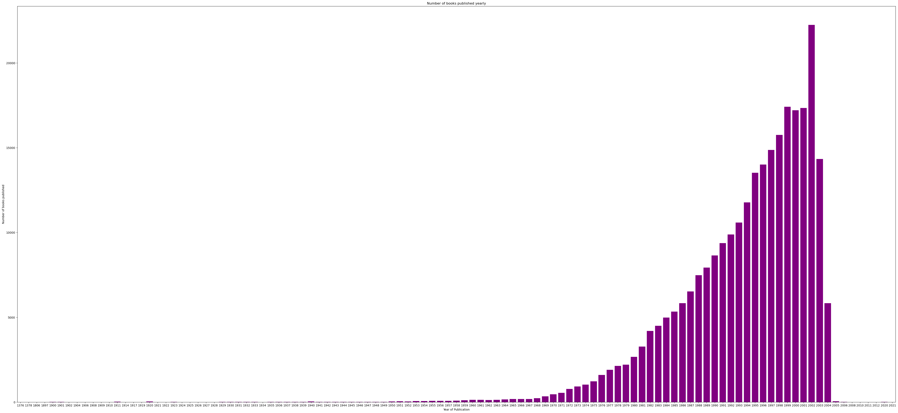
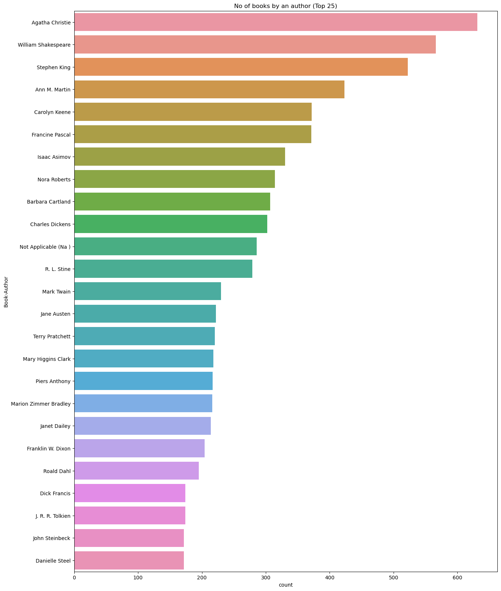
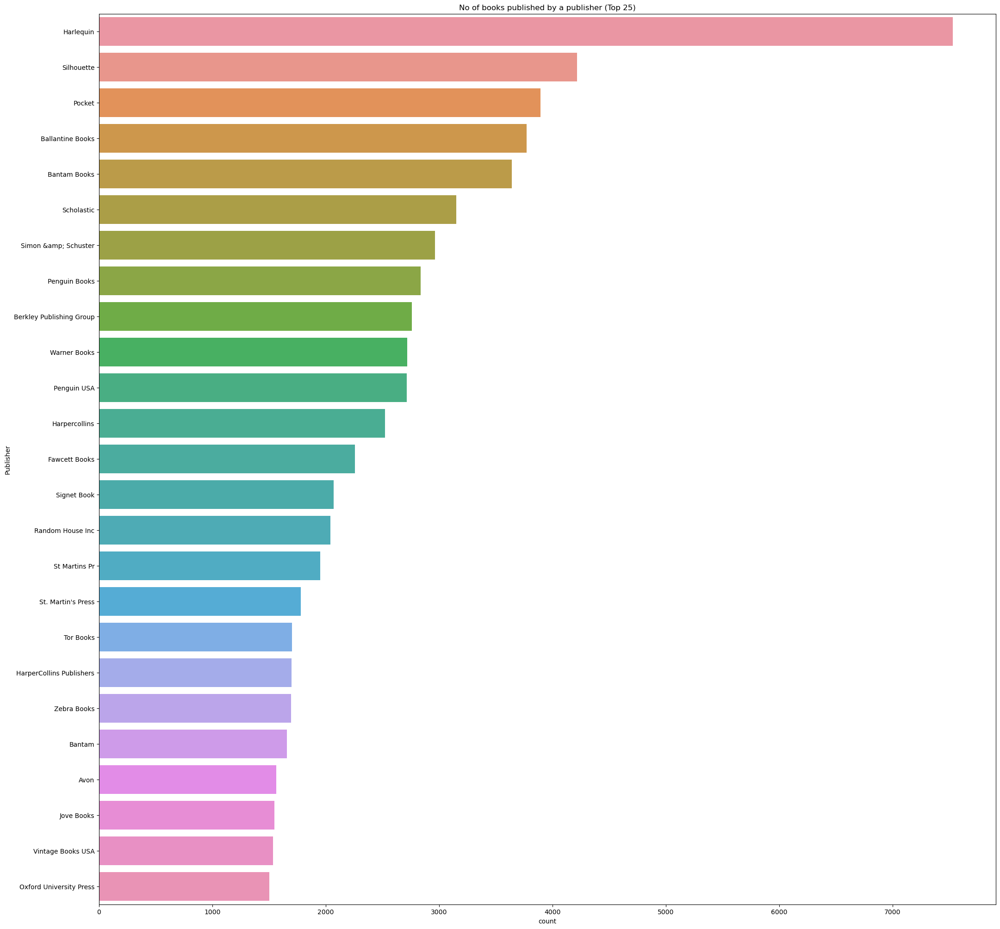
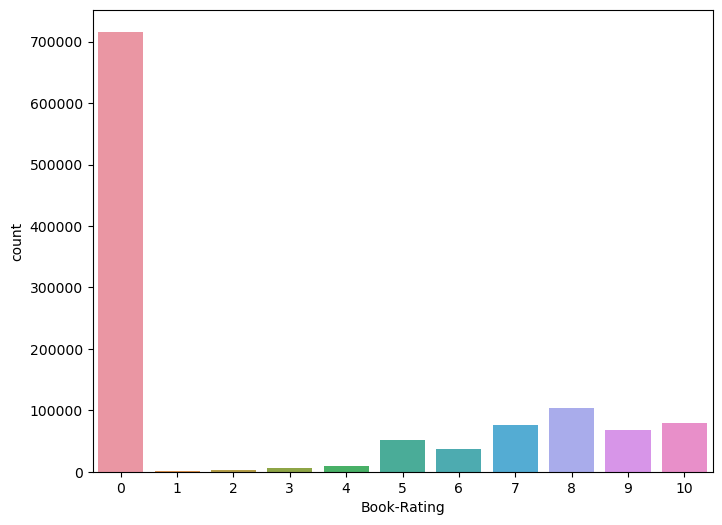
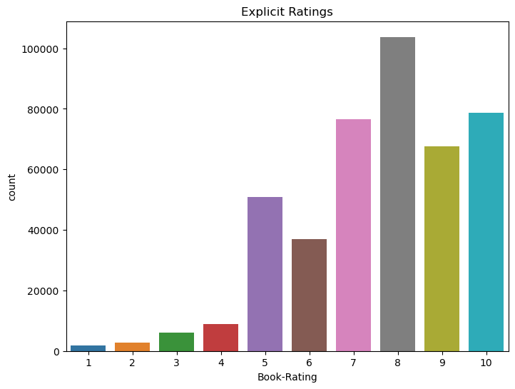
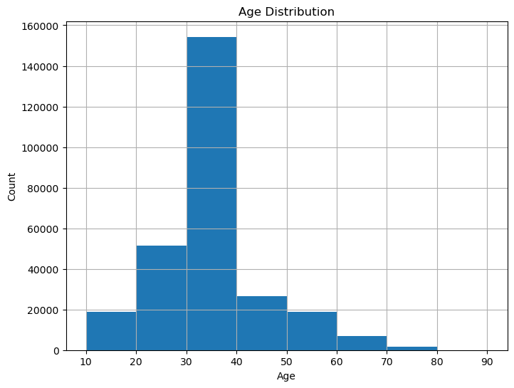
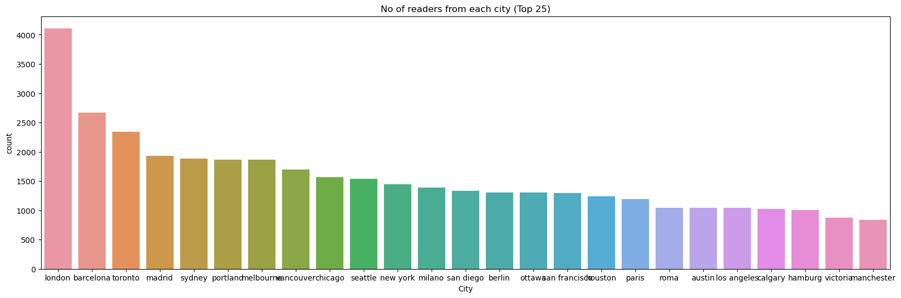
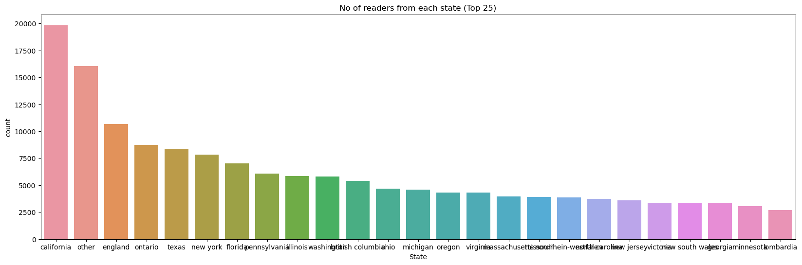
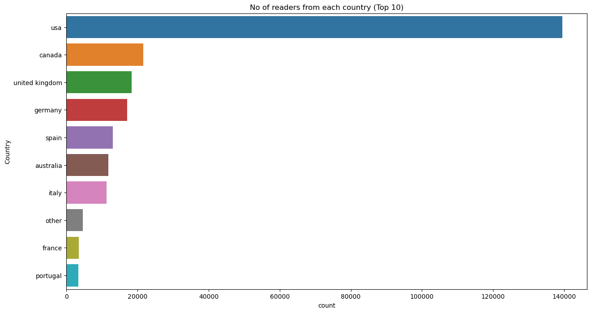
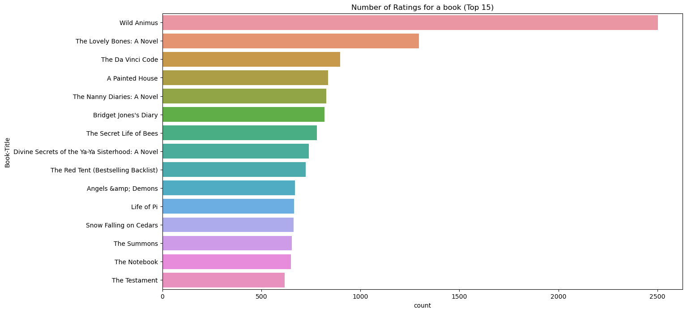

```python
import re
import pickle
import operator
import numpy as np
import pandas as pd
import seaborn as sns
import matplotlib.pyplot as plt
from collections import Counter
from scipy.sparse import csr_matrix
from pandas.api.types import is_numeric_dtype
from sklearn.neighbors import NearestNeighbors
from sklearn.feature_extraction import DictVectorizer
from sklearn.metrics.pairwise import cosine_similarity
from sklearn.feature_extraction.text import TfidfVectorizer

import warnings
warnings.filterwarnings("ignore")
```

## DATASET LOADING


```python
books = pd.read_csv(r"BX-Books.csv", delimiter=';', error_bad_lines=False, encoding='ISO-8859-1', warn_bad_lines=False)
users = pd.read_csv(r"BX-Users.csv", delimiter=';', error_bad_lines=False, encoding='ISO-8859-1', warn_bad_lines=False)
ratings = pd.read_csv(r"BX-Book-Ratings.csv", delimiter=';', error_bad_lines=False, encoding='ISO-8859-1', warn_bad_lines=False)

print("Books Data:    ", books.shape)
print("Users Data:    ", users.shape)
print("Books-ratings: ", ratings.shape)
```

    Books Data:     (271360, 8)
    Users Data:     (278858, 3)
    Books-ratings:  (1149780, 3)
    


```python
books.head(50)
```


<div>
<style scoped>
    .dataframe tbody tr th:only-of-type {
        vertical-align: middle;
    }

    .dataframe tbody tr th {
        vertical-align: top;
    }

    .dataframe thead th {
        text-align: right;
    }
</style>
<table border="1" class="dataframe">
  <thead>
    <tr style="text-align: right;">
      <th></th>
      <th>ISBN</th>
      <th>Book-Title</th>
      <th>Book-Author</th>
      <th>Year-Of-Publication</th>
      <th>Publisher</th>
      <th>Image-URL-S</th>
      <th>Image-URL-M</th>
      <th>Image-URL-L</th>
    </tr>
  </thead>
  <tbody>
    <tr>
      <th>0</th>
      <td>0195153448</td>
      <td>Classical Mythology</td>
      <td>Mark P. O. Morford</td>
      <td>2002</td>
      <td>Oxford University Press</td>
      <td>http://images.amazon.com/images/P/0195153448.0...</td>
      <td>http://images.amazon.com/images/P/0195153448.0...</td>
      <td>http://images.amazon.com/images/P/0195153448.0...</td>
    </tr>
    <tr>
      <th>1</th>
      <td>0002005018</td>
      <td>Clara Callan</td>
      <td>Richard Bruce Wright</td>
      <td>2001</td>
      <td>HarperFlamingo Canada</td>
      <td>http://images.amazon.com/images/P/0002005018.0...</td>
      <td>http://images.amazon.com/images/P/0002005018.0...</td>
      <td>http://images.amazon.com/images/P/0002005018.0...</td>
    </tr>
    <tr>
      <th>2</th>
      <td>0060973129</td>
      <td>Decision in Normandy</td>
      <td>Carlo D'Este</td>
      <td>1991</td>
      <td>HarperPerennial</td>
      <td>http://images.amazon.com/images/P/0060973129.0...</td>
      <td>http://images.amazon.com/images/P/0060973129.0...</td>
      <td>http://images.amazon.com/images/P/0060973129.0...</td>
    </tr>
    <tr>
      <th>3</th>
      <td>0374157065</td>
      <td>Flu: The Story of the Great Influenza Pandemic...</td>
      <td>Gina Bari Kolata</td>
      <td>1999</td>
      <td>Farrar Straus Giroux</td>
      <td>http://images.amazon.com/images/P/0374157065.0...</td>
      <td>http://images.amazon.com/images/P/0374157065.0...</td>
      <td>http://images.amazon.com/images/P/0374157065.0...</td>
    </tr>
    <tr>
      <th>4</th>
      <td>0393045218</td>
      <td>The Mummies of Urumchi</td>
      <td>E. J. W. Barber</td>
      <td>1999</td>
      <td>W. W. Norton &amp;amp; Company</td>
      <td>http://images.amazon.com/images/P/0393045218.0...</td>
      <td>http://images.amazon.com/images/P/0393045218.0...</td>
      <td>http://images.amazon.com/images/P/0393045218.0...</td>
    </tr>
    <tr>
      <th>5</th>
      <td>0399135782</td>
      <td>The Kitchen God's Wife</td>
      <td>Amy Tan</td>
      <td>1991</td>
      <td>Putnam Pub Group</td>
      <td>http://images.amazon.com/images/P/0399135782.0...</td>
      <td>http://images.amazon.com/images/P/0399135782.0...</td>
      <td>http://images.amazon.com/images/P/0399135782.0...</td>
    </tr>
    <tr>
      <th>6</th>
      <td>0425176428</td>
      <td>What If?: The World's Foremost Military Histor...</td>
      <td>Robert Cowley</td>
      <td>2000</td>
      <td>Berkley Publishing Group</td>
      <td>http://images.amazon.com/images/P/0425176428.0...</td>
      <td>http://images.amazon.com/images/P/0425176428.0...</td>
      <td>http://images.amazon.com/images/P/0425176428.0...</td>
    </tr>
    <tr>
      <th>7</th>
      <td>0671870432</td>
      <td>PLEADING GUILTY</td>
      <td>Scott Turow</td>
      <td>1993</td>
      <td>Audioworks</td>
      <td>http://images.amazon.com/images/P/0671870432.0...</td>
      <td>http://images.amazon.com/images/P/0671870432.0...</td>
      <td>http://images.amazon.com/images/P/0671870432.0...</td>
    </tr>
    <tr>
      <th>8</th>
      <td>0679425608</td>
      <td>Under the Black Flag: The Romance and the Real...</td>
      <td>David Cordingly</td>
      <td>1996</td>
      <td>Random House</td>
      <td>http://images.amazon.com/images/P/0679425608.0...</td>
      <td>http://images.amazon.com/images/P/0679425608.0...</td>
      <td>http://images.amazon.com/images/P/0679425608.0...</td>
    </tr>
    <tr>
      <th>9</th>
      <td>074322678X</td>
      <td>Where You'll Find Me: And Other Stories</td>
      <td>Ann Beattie</td>
      <td>2002</td>
      <td>Scribner</td>
      <td>http://images.amazon.com/images/P/074322678X.0...</td>
      <td>http://images.amazon.com/images/P/074322678X.0...</td>
      <td>http://images.amazon.com/images/P/074322678X.0...</td>
    </tr>
    <tr>
      <th>10</th>
      <td>0771074670</td>
      <td>Nights Below Station Street</td>
      <td>David Adams Richards</td>
      <td>1988</td>
      <td>Emblem Editions</td>
      <td>http://images.amazon.com/images/P/0771074670.0...</td>
      <td>http://images.amazon.com/images/P/0771074670.0...</td>
      <td>http://images.amazon.com/images/P/0771074670.0...</td>
    </tr>
    <tr>
      <th>11</th>
      <td>080652121X</td>
      <td>Hitler's Secret Bankers: The Myth of Swiss Neu...</td>
      <td>Adam Lebor</td>
      <td>2000</td>
      <td>Citadel Press</td>
      <td>http://images.amazon.com/images/P/080652121X.0...</td>
      <td>http://images.amazon.com/images/P/080652121X.0...</td>
      <td>http://images.amazon.com/images/P/080652121X.0...</td>
    </tr>
    <tr>
      <th>12</th>
      <td>0887841740</td>
      <td>The Middle Stories</td>
      <td>Sheila Heti</td>
      <td>2004</td>
      <td>House of Anansi Press</td>
      <td>http://images.amazon.com/images/P/0887841740.0...</td>
      <td>http://images.amazon.com/images/P/0887841740.0...</td>
      <td>http://images.amazon.com/images/P/0887841740.0...</td>
    </tr>
    <tr>
      <th>13</th>
      <td>1552041778</td>
      <td>Jane Doe</td>
      <td>R. J. Kaiser</td>
      <td>1999</td>
      <td>Mira Books</td>
      <td>http://images.amazon.com/images/P/1552041778.0...</td>
      <td>http://images.amazon.com/images/P/1552041778.0...</td>
      <td>http://images.amazon.com/images/P/1552041778.0...</td>
    </tr>
    <tr>
      <th>14</th>
      <td>1558746218</td>
      <td>A Second Chicken Soup for the Woman's Soul (Ch...</td>
      <td>Jack Canfield</td>
      <td>1998</td>
      <td>Health Communications</td>
      <td>http://images.amazon.com/images/P/1558746218.0...</td>
      <td>http://images.amazon.com/images/P/1558746218.0...</td>
      <td>http://images.amazon.com/images/P/1558746218.0...</td>
    </tr>
    <tr>
      <th>15</th>
      <td>1567407781</td>
      <td>The Witchfinder (Amos Walker Mystery Series)</td>
      <td>Loren D. Estleman</td>
      <td>1998</td>
      <td>Brilliance Audio - Trade</td>
      <td>http://images.amazon.com/images/P/1567407781.0...</td>
      <td>http://images.amazon.com/images/P/1567407781.0...</td>
      <td>http://images.amazon.com/images/P/1567407781.0...</td>
    </tr>
    <tr>
      <th>16</th>
      <td>1575663937</td>
      <td>More Cunning Than Man: A Social History of Rat...</td>
      <td>Robert Hendrickson</td>
      <td>1999</td>
      <td>Kensington Publishing Corp.</td>
      <td>http://images.amazon.com/images/P/1575663937.0...</td>
      <td>http://images.amazon.com/images/P/1575663937.0...</td>
      <td>http://images.amazon.com/images/P/1575663937.0...</td>
    </tr>
    <tr>
      <th>17</th>
      <td>1881320189</td>
      <td>Goodbye to the Buttermilk Sky</td>
      <td>Julia Oliver</td>
      <td>1994</td>
      <td>River City Pub</td>
      <td>http://images.amazon.com/images/P/1881320189.0...</td>
      <td>http://images.amazon.com/images/P/1881320189.0...</td>
      <td>http://images.amazon.com/images/P/1881320189.0...</td>
    </tr>
    <tr>
      <th>18</th>
      <td>0440234743</td>
      <td>The Testament</td>
      <td>John Grisham</td>
      <td>1999</td>
      <td>Dell</td>
      <td>http://images.amazon.com/images/P/0440234743.0...</td>
      <td>http://images.amazon.com/images/P/0440234743.0...</td>
      <td>http://images.amazon.com/images/P/0440234743.0...</td>
    </tr>
    <tr>
      <th>19</th>
      <td>0452264464</td>
      <td>Beloved (Plume Contemporary Fiction)</td>
      <td>Toni Morrison</td>
      <td>1994</td>
      <td>Plume</td>
      <td>http://images.amazon.com/images/P/0452264464.0...</td>
      <td>http://images.amazon.com/images/P/0452264464.0...</td>
      <td>http://images.amazon.com/images/P/0452264464.0...</td>
    </tr>
    <tr>
      <th>20</th>
      <td>0609804618</td>
      <td>Our Dumb Century: The Onion Presents 100 Years...</td>
      <td>The Onion</td>
      <td>1999</td>
      <td>Three Rivers Press</td>
      <td>http://images.amazon.com/images/P/0609804618.0...</td>
      <td>http://images.amazon.com/images/P/0609804618.0...</td>
      <td>http://images.amazon.com/images/P/0609804618.0...</td>
    </tr>
    <tr>
      <th>21</th>
      <td>1841721522</td>
      <td>New Vegetarian: Bold and Beautiful Recipes for...</td>
      <td>Celia Brooks Brown</td>
      <td>2001</td>
      <td>Ryland Peters &amp;amp; Small Ltd</td>
      <td>http://images.amazon.com/images/P/1841721522.0...</td>
      <td>http://images.amazon.com/images/P/1841721522.0...</td>
      <td>http://images.amazon.com/images/P/1841721522.0...</td>
    </tr>
    <tr>
      <th>22</th>
      <td>1879384493</td>
      <td>If I'd Known Then What I Know Now: Why Not Lea...</td>
      <td>J. R. Parrish</td>
      <td>2003</td>
      <td>Cypress House</td>
      <td>http://images.amazon.com/images/P/1879384493.0...</td>
      <td>http://images.amazon.com/images/P/1879384493.0...</td>
      <td>http://images.amazon.com/images/P/1879384493.0...</td>
    </tr>
    <tr>
      <th>23</th>
      <td>0061076031</td>
      <td>Mary-Kate &amp;amp; Ashley Switching Goals (Mary-K...</td>
      <td>Mary-Kate &amp;amp; Ashley Olsen</td>
      <td>2000</td>
      <td>HarperEntertainment</td>
      <td>http://images.amazon.com/images/P/0061076031.0...</td>
      <td>http://images.amazon.com/images/P/0061076031.0...</td>
      <td>http://images.amazon.com/images/P/0061076031.0...</td>
    </tr>
    <tr>
      <th>24</th>
      <td>0439095026</td>
      <td>Tell Me This Isn't Happening</td>
      <td>Robynn Clairday</td>
      <td>1999</td>
      <td>Scholastic</td>
      <td>http://images.amazon.com/images/P/0439095026.0...</td>
      <td>http://images.amazon.com/images/P/0439095026.0...</td>
      <td>http://images.amazon.com/images/P/0439095026.0...</td>
    </tr>
    <tr>
      <th>25</th>
      <td>0689821166</td>
      <td>Flood : Mississippi 1927</td>
      <td>Kathleen Duey</td>
      <td>1998</td>
      <td>Aladdin</td>
      <td>http://images.amazon.com/images/P/0689821166.0...</td>
      <td>http://images.amazon.com/images/P/0689821166.0...</td>
      <td>http://images.amazon.com/images/P/0689821166.0...</td>
    </tr>
    <tr>
      <th>26</th>
      <td>0971880107</td>
      <td>Wild Animus</td>
      <td>Rich Shapero</td>
      <td>2004</td>
      <td>Too Far</td>
      <td>http://images.amazon.com/images/P/0971880107.0...</td>
      <td>http://images.amazon.com/images/P/0971880107.0...</td>
      <td>http://images.amazon.com/images/P/0971880107.0...</td>
    </tr>
    <tr>
      <th>27</th>
      <td>0345402871</td>
      <td>Airframe</td>
      <td>Michael Crichton</td>
      <td>1997</td>
      <td>Ballantine Books</td>
      <td>http://images.amazon.com/images/P/0345402871.0...</td>
      <td>http://images.amazon.com/images/P/0345402871.0...</td>
      <td>http://images.amazon.com/images/P/0345402871.0...</td>
    </tr>
    <tr>
      <th>28</th>
      <td>0345417623</td>
      <td>Timeline</td>
      <td>MICHAEL CRICHTON</td>
      <td>2000</td>
      <td>Ballantine Books</td>
      <td>http://images.amazon.com/images/P/0345417623.0...</td>
      <td>http://images.amazon.com/images/P/0345417623.0...</td>
      <td>http://images.amazon.com/images/P/0345417623.0...</td>
    </tr>
    <tr>
      <th>29</th>
      <td>0684823802</td>
      <td>OUT OF THE SILENT PLANET</td>
      <td>C.S. Lewis</td>
      <td>1996</td>
      <td>Scribner</td>
      <td>http://images.amazon.com/images/P/0684823802.0...</td>
      <td>http://images.amazon.com/images/P/0684823802.0...</td>
      <td>http://images.amazon.com/images/P/0684823802.0...</td>
    </tr>
    <tr>
      <th>30</th>
      <td>0375759778</td>
      <td>Prague : A Novel</td>
      <td>ARTHUR PHILLIPS</td>
      <td>2003</td>
      <td>Random House Trade Paperbacks</td>
      <td>http://images.amazon.com/images/P/0375759778.0...</td>
      <td>http://images.amazon.com/images/P/0375759778.0...</td>
      <td>http://images.amazon.com/images/P/0375759778.0...</td>
    </tr>
    <tr>
      <th>31</th>
      <td>0425163091</td>
      <td>Chocolate Jesus</td>
      <td>Stephan Jaramillo</td>
      <td>1998</td>
      <td>Berkley Publishing Group</td>
      <td>http://images.amazon.com/images/P/0425163091.0...</td>
      <td>http://images.amazon.com/images/P/0425163091.0...</td>
      <td>http://images.amazon.com/images/P/0425163091.0...</td>
    </tr>
    <tr>
      <th>32</th>
      <td>3404921038</td>
      <td>Wie Barney es sieht.</td>
      <td>Mordecai Richler</td>
      <td>2002</td>
      <td>L�¼bbe</td>
      <td>http://images.amazon.com/images/P/3404921038.0...</td>
      <td>http://images.amazon.com/images/P/3404921038.0...</td>
      <td>http://images.amazon.com/images/P/3404921038.0...</td>
    </tr>
    <tr>
      <th>33</th>
      <td>3442353866</td>
      <td>Der Fluch der Kaiserin. Ein Richter- Di- Roman.</td>
      <td>Eleanor Cooney</td>
      <td>2001</td>
      <td>Goldmann</td>
      <td>http://images.amazon.com/images/P/3442353866.0...</td>
      <td>http://images.amazon.com/images/P/3442353866.0...</td>
      <td>http://images.amazon.com/images/P/3442353866.0...</td>
    </tr>
    <tr>
      <th>34</th>
      <td>3442410665</td>
      <td>Sturmzeit. Roman.</td>
      <td>Charlotte Link</td>
      <td>1991</td>
      <td>Goldmann</td>
      <td>http://images.amazon.com/images/P/3442410665.0...</td>
      <td>http://images.amazon.com/images/P/3442410665.0...</td>
      <td>http://images.amazon.com/images/P/3442410665.0...</td>
    </tr>
    <tr>
      <th>35</th>
      <td>3442446937</td>
      <td>Tage der Unschuld.</td>
      <td>Richard North Patterson</td>
      <td>2000</td>
      <td>Goldmann</td>
      <td>http://images.amazon.com/images/P/3442446937.0...</td>
      <td>http://images.amazon.com/images/P/3442446937.0...</td>
      <td>http://images.amazon.com/images/P/3442446937.0...</td>
    </tr>
    <tr>
      <th>36</th>
      <td>0375406328</td>
      <td>Lying Awake</td>
      <td>Mark Salzman</td>
      <td>2000</td>
      <td>Alfred A. Knopf</td>
      <td>http://images.amazon.com/images/P/0375406328.0...</td>
      <td>http://images.amazon.com/images/P/0375406328.0...</td>
      <td>http://images.amazon.com/images/P/0375406328.0...</td>
    </tr>
    <tr>
      <th>37</th>
      <td>0446310786</td>
      <td>To Kill a Mockingbird</td>
      <td>Harper Lee</td>
      <td>1988</td>
      <td>Little Brown &amp;amp; Company</td>
      <td>http://images.amazon.com/images/P/0446310786.0...</td>
      <td>http://images.amazon.com/images/P/0446310786.0...</td>
      <td>http://images.amazon.com/images/P/0446310786.0...</td>
    </tr>
    <tr>
      <th>38</th>
      <td>0449005615</td>
      <td>Seabiscuit: An American Legend</td>
      <td>LAURA HILLENBRAND</td>
      <td>2002</td>
      <td>Ballantine Books</td>
      <td>http://images.amazon.com/images/P/0449005615.0...</td>
      <td>http://images.amazon.com/images/P/0449005615.0...</td>
      <td>http://images.amazon.com/images/P/0449005615.0...</td>
    </tr>
    <tr>
      <th>39</th>
      <td>0060168013</td>
      <td>Pigs in Heaven</td>
      <td>Barbara Kingsolver</td>
      <td>1993</td>
      <td>Harpercollins</td>
      <td>http://images.amazon.com/images/P/0060168013.0...</td>
      <td>http://images.amazon.com/images/P/0060168013.0...</td>
      <td>http://images.amazon.com/images/P/0060168013.0...</td>
    </tr>
    <tr>
      <th>40</th>
      <td>038078243X</td>
      <td>Miss Zukas and the Raven's Dance</td>
      <td>Jo Dereske</td>
      <td>1996</td>
      <td>Avon</td>
      <td>http://images.amazon.com/images/P/038078243X.0...</td>
      <td>http://images.amazon.com/images/P/038078243X.0...</td>
      <td>http://images.amazon.com/images/P/038078243X.0...</td>
    </tr>
    <tr>
      <th>41</th>
      <td>055321215X</td>
      <td>Pride and Prejudice</td>
      <td>Jane Austen</td>
      <td>1983</td>
      <td>Bantam</td>
      <td>http://images.amazon.com/images/P/055321215X.0...</td>
      <td>http://images.amazon.com/images/P/055321215X.0...</td>
      <td>http://images.amazon.com/images/P/055321215X.0...</td>
    </tr>
    <tr>
      <th>42</th>
      <td>067176537X</td>
      <td>The Therapeutic Touch: How to Use Your Hands t...</td>
      <td>Dolores Krieger</td>
      <td>1979</td>
      <td>Fireside</td>
      <td>http://images.amazon.com/images/P/067176537X.0...</td>
      <td>http://images.amazon.com/images/P/067176537X.0...</td>
      <td>http://images.amazon.com/images/P/067176537X.0...</td>
    </tr>
    <tr>
      <th>43</th>
      <td>0061099686</td>
      <td>Downtown</td>
      <td>Anne Rivers Siddons</td>
      <td>1995</td>
      <td>HarperTorch</td>
      <td>http://images.amazon.com/images/P/0061099686.0...</td>
      <td>http://images.amazon.com/images/P/0061099686.0...</td>
      <td>http://images.amazon.com/images/P/0061099686.0...</td>
    </tr>
    <tr>
      <th>44</th>
      <td>0553582909</td>
      <td>Icebound</td>
      <td>Dean R. Koontz</td>
      <td>2000</td>
      <td>Bantam Books</td>
      <td>http://images.amazon.com/images/P/0553582909.0...</td>
      <td>http://images.amazon.com/images/P/0553582909.0...</td>
      <td>http://images.amazon.com/images/P/0553582909.0...</td>
    </tr>
    <tr>
      <th>45</th>
      <td>0671888587</td>
      <td>I'll Be Seeing You</td>
      <td>Mary Higgins Clark</td>
      <td>1994</td>
      <td>Pocket</td>
      <td>http://images.amazon.com/images/P/0671888587.0...</td>
      <td>http://images.amazon.com/images/P/0671888587.0...</td>
      <td>http://images.amazon.com/images/P/0671888587.0...</td>
    </tr>
    <tr>
      <th>46</th>
      <td>0553582747</td>
      <td>From the Corner of His Eye</td>
      <td>Dean Koontz</td>
      <td>2001</td>
      <td>Bantam Books</td>
      <td>http://images.amazon.com/images/P/0553582747.0...</td>
      <td>http://images.amazon.com/images/P/0553582747.0...</td>
      <td>http://images.amazon.com/images/P/0553582747.0...</td>
    </tr>
    <tr>
      <th>47</th>
      <td>0425182908</td>
      <td>Isle of Dogs</td>
      <td>Patricia Cornwell</td>
      <td>2002</td>
      <td>Berkley Publishing Group</td>
      <td>http://images.amazon.com/images/P/0425182908.0...</td>
      <td>http://images.amazon.com/images/P/0425182908.0...</td>
      <td>http://images.amazon.com/images/P/0425182908.0...</td>
    </tr>
    <tr>
      <th>48</th>
      <td>042518630X</td>
      <td>Purity in Death</td>
      <td>J.D. Robb</td>
      <td>2002</td>
      <td>Berkley Publishing Group</td>
      <td>http://images.amazon.com/images/P/042518630X.0...</td>
      <td>http://images.amazon.com/images/P/042518630X.0...</td>
      <td>http://images.amazon.com/images/P/042518630X.0...</td>
    </tr>
    <tr>
      <th>49</th>
      <td>0440223571</td>
      <td>This Year It Will Be Different: And Other Stories</td>
      <td>Maeve Binchy</td>
      <td>1997</td>
      <td>Dell</td>
      <td>http://images.amazon.com/images/P/0440223571.0...</td>
      <td>http://images.amazon.com/images/P/0440223571.0...</td>
      <td>http://images.amazon.com/images/P/0440223571.0...</td>
    </tr>
  </tbody>
</table>
</div>


```python

```


```python
(users.head(50))
```


<div>
<style scoped>
    .dataframe tbody tr th:only-of-type {
        vertical-align: middle;
    }

    .dataframe tbody tr th {
        vertical-align: top;
    }

    .dataframe thead th {
        text-align: right;
    }
</style>
<table border="1" class="dataframe">
  <thead>
    <tr style="text-align: right;">
      <th></th>
      <th>User-ID</th>
      <th>Location</th>
      <th>Age</th>
    </tr>
  </thead>
  <tbody>
    <tr>
      <th>0</th>
      <td>1</td>
      <td>nyc, new york, usa</td>
      <td>NaN</td>
    </tr>
    <tr>
      <th>1</th>
      <td>2</td>
      <td>stockton, california, usa</td>
      <td>18.0</td>
    </tr>
    <tr>
      <th>2</th>
      <td>3</td>
      <td>moscow, yukon territory, russia</td>
      <td>NaN</td>
    </tr>
    <tr>
      <th>3</th>
      <td>4</td>
      <td>porto, v.n.gaia, portugal</td>
      <td>17.0</td>
    </tr>
    <tr>
      <th>4</th>
      <td>5</td>
      <td>farnborough, hants, united kingdom</td>
      <td>NaN</td>
    </tr>
    <tr>
      <th>5</th>
      <td>6</td>
      <td>santa monica, california, usa</td>
      <td>61.0</td>
    </tr>
    <tr>
      <th>6</th>
      <td>7</td>
      <td>washington, dc, usa</td>
      <td>NaN</td>
    </tr>
    <tr>
      <th>7</th>
      <td>8</td>
      <td>timmins, ontario, canada</td>
      <td>NaN</td>
    </tr>
    <tr>
      <th>8</th>
      <td>9</td>
      <td>germantown, tennessee, usa</td>
      <td>NaN</td>
    </tr>
    <tr>
      <th>9</th>
      <td>10</td>
      <td>albacete, wisconsin, spain</td>
      <td>26.0</td>
    </tr>
    <tr>
      <th>10</th>
      <td>11</td>
      <td>melbourne, victoria, australia</td>
      <td>14.0</td>
    </tr>
    <tr>
      <th>11</th>
      <td>12</td>
      <td>fort bragg, california, usa</td>
      <td>NaN</td>
    </tr>
    <tr>
      <th>12</th>
      <td>13</td>
      <td>barcelona, barcelona, spain</td>
      <td>26.0</td>
    </tr>
    <tr>
      <th>13</th>
      <td>14</td>
      <td>mediapolis, iowa, usa</td>
      <td>NaN</td>
    </tr>
    <tr>
      <th>14</th>
      <td>15</td>
      <td>calgary, alberta, canada</td>
      <td>NaN</td>
    </tr>
    <tr>
      <th>15</th>
      <td>16</td>
      <td>albuquerque, new mexico, usa</td>
      <td>NaN</td>
    </tr>
    <tr>
      <th>16</th>
      <td>17</td>
      <td>chesapeake, virginia, usa</td>
      <td>NaN</td>
    </tr>
    <tr>
      <th>17</th>
      <td>18</td>
      <td>rio de janeiro, rio de janeiro, brazil</td>
      <td>25.0</td>
    </tr>
    <tr>
      <th>18</th>
      <td>19</td>
      <td>weston, ,</td>
      <td>14.0</td>
    </tr>
    <tr>
      <th>19</th>
      <td>20</td>
      <td>langhorne, pennsylvania, usa</td>
      <td>19.0</td>
    </tr>
    <tr>
      <th>20</th>
      <td>21</td>
      <td>ferrol / spain, alabama, spain</td>
      <td>46.0</td>
    </tr>
    <tr>
      <th>21</th>
      <td>22</td>
      <td>erfurt, thueringen, germany</td>
      <td>NaN</td>
    </tr>
    <tr>
      <th>22</th>
      <td>23</td>
      <td>philadelphia, pennsylvania, usa</td>
      <td>NaN</td>
    </tr>
    <tr>
      <th>23</th>
      <td>24</td>
      <td>cologne, nrw, germany</td>
      <td>19.0</td>
    </tr>
    <tr>
      <th>24</th>
      <td>25</td>
      <td>oakland, california, usa</td>
      <td>55.0</td>
    </tr>
    <tr>
      <th>25</th>
      <td>26</td>
      <td>bellevue, washington, usa</td>
      <td>NaN</td>
    </tr>
    <tr>
      <th>26</th>
      <td>27</td>
      <td>chicago, illinois, usa</td>
      <td>32.0</td>
    </tr>
    <tr>
      <th>27</th>
      <td>28</td>
      <td>freiburg, baden-wuerttemberg, germany</td>
      <td>24.0</td>
    </tr>
    <tr>
      <th>28</th>
      <td>29</td>
      <td>cuernavaca, alabama, mexico</td>
      <td>19.0</td>
    </tr>
    <tr>
      <th>29</th>
      <td>30</td>
      <td>anchorage, alaska, usa</td>
      <td>24.0</td>
    </tr>
    <tr>
      <th>30</th>
      <td>31</td>
      <td>shanghai, n/a, china</td>
      <td>20.0</td>
    </tr>
    <tr>
      <th>31</th>
      <td>32</td>
      <td>portland, oregon, usa</td>
      <td>NaN</td>
    </tr>
    <tr>
      <th>32</th>
      <td>33</td>
      <td>costa mesa, california, usa</td>
      <td>34.0</td>
    </tr>
    <tr>
      <th>33</th>
      <td>34</td>
      <td>london, england, united kingdom</td>
      <td>NaN</td>
    </tr>
    <tr>
      <th>34</th>
      <td>35</td>
      <td>grafton, wisconsin, usa</td>
      <td>17.0</td>
    </tr>
    <tr>
      <th>35</th>
      <td>36</td>
      <td>montreal, quebec, canada</td>
      <td>24.0</td>
    </tr>
    <tr>
      <th>36</th>
      <td>37</td>
      <td>san sebastian, n/a, spain</td>
      <td>23.0</td>
    </tr>
    <tr>
      <th>37</th>
      <td>38</td>
      <td>viterbo, lazio, italy</td>
      <td>34.0</td>
    </tr>
    <tr>
      <th>38</th>
      <td>39</td>
      <td>cary, north carolina, usa</td>
      <td>NaN</td>
    </tr>
    <tr>
      <th>39</th>
      <td>40</td>
      <td>tonawanda, new york, usa</td>
      <td>32.0</td>
    </tr>
    <tr>
      <th>40</th>
      <td>41</td>
      <td>santee, california, usa</td>
      <td>14.0</td>
    </tr>
    <tr>
      <th>41</th>
      <td>42</td>
      <td>appleton, wisconsin, usa</td>
      <td>17.0</td>
    </tr>
    <tr>
      <th>42</th>
      <td>43</td>
      <td>méxico, méxico city, distrito federal</td>
      <td>NaN</td>
    </tr>
    <tr>
      <th>43</th>
      <td>44</td>
      <td>black mountain, north carolina, usa</td>
      <td>51.0</td>
    </tr>
    <tr>
      <th>44</th>
      <td>45</td>
      <td>berlin, n/a, germany</td>
      <td>NaN</td>
    </tr>
    <tr>
      <th>45</th>
      <td>46</td>
      <td>heidelberg, baden-wuerttemberg, germany</td>
      <td>31.0</td>
    </tr>
    <tr>
      <th>46</th>
      <td>47</td>
      <td>vicenza, veneto, italy</td>
      <td>21.0</td>
    </tr>
    <tr>
      <th>47</th>
      <td>48</td>
      <td>chicago, illinois, usa</td>
      <td>NaN</td>
    </tr>
    <tr>
      <th>48</th>
      <td>49</td>
      <td>rome, rome, italy</td>
      <td>NaN</td>
    </tr>
    <tr>
      <th>49</th>
      <td>50</td>
      <td>london, england, united kingdom</td>
      <td>17.0</td>
    </tr>
  </tbody>
</table>
</div>


```python
ratings.head(50)
```


<div>
<style scoped>
    .dataframe tbody tr th:only-of-type {
        vertical-align: middle;
    }

    .dataframe tbody tr th {
        vertical-align: top;
    }

    .dataframe thead th {
        text-align: right;
    }
</style>
<table border="1" class="dataframe">
  <thead>
    <tr style="text-align: right;">
      <th></th>
      <th>User-ID</th>
      <th>ISBN</th>
      <th>Book-Rating</th>
    </tr>
  </thead>
  <tbody>
    <tr>
      <th>0</th>
      <td>276725</td>
      <td>034545104X</td>
      <td>0</td>
    </tr>
    <tr>
      <th>1</th>
      <td>276726</td>
      <td>0155061224</td>
      <td>5</td>
    </tr>
    <tr>
      <th>2</th>
      <td>276727</td>
      <td>0446520802</td>
      <td>0</td>
    </tr>
    <tr>
      <th>3</th>
      <td>276729</td>
      <td>052165615X</td>
      <td>3</td>
    </tr>
    <tr>
      <th>4</th>
      <td>276729</td>
      <td>0521795028</td>
      <td>6</td>
    </tr>
    <tr>
      <th>5</th>
      <td>276733</td>
      <td>2080674722</td>
      <td>0</td>
    </tr>
    <tr>
      <th>6</th>
      <td>276736</td>
      <td>3257224281</td>
      <td>8</td>
    </tr>
    <tr>
      <th>7</th>
      <td>276737</td>
      <td>0600570967</td>
      <td>6</td>
    </tr>
    <tr>
      <th>8</th>
      <td>276744</td>
      <td>038550120X</td>
      <td>7</td>
    </tr>
    <tr>
      <th>9</th>
      <td>276745</td>
      <td>342310538</td>
      <td>10</td>
    </tr>
    <tr>
      <th>10</th>
      <td>276746</td>
      <td>0425115801</td>
      <td>0</td>
    </tr>
    <tr>
      <th>11</th>
      <td>276746</td>
      <td>0449006522</td>
      <td>0</td>
    </tr>
    <tr>
      <th>12</th>
      <td>276746</td>
      <td>0553561618</td>
      <td>0</td>
    </tr>
    <tr>
      <th>13</th>
      <td>276746</td>
      <td>055356451X</td>
      <td>0</td>
    </tr>
    <tr>
      <th>14</th>
      <td>276746</td>
      <td>0786013990</td>
      <td>0</td>
    </tr>
    <tr>
      <th>15</th>
      <td>276746</td>
      <td>0786014512</td>
      <td>0</td>
    </tr>
    <tr>
      <th>16</th>
      <td>276747</td>
      <td>0060517794</td>
      <td>9</td>
    </tr>
    <tr>
      <th>17</th>
      <td>276747</td>
      <td>0451192001</td>
      <td>0</td>
    </tr>
    <tr>
      <th>18</th>
      <td>276747</td>
      <td>0609801279</td>
      <td>0</td>
    </tr>
    <tr>
      <th>19</th>
      <td>276747</td>
      <td>0671537458</td>
      <td>9</td>
    </tr>
    <tr>
      <th>20</th>
      <td>276747</td>
      <td>0679776818</td>
      <td>8</td>
    </tr>
    <tr>
      <th>21</th>
      <td>276747</td>
      <td>0943066433</td>
      <td>7</td>
    </tr>
    <tr>
      <th>22</th>
      <td>276747</td>
      <td>1570231028</td>
      <td>0</td>
    </tr>
    <tr>
      <th>23</th>
      <td>276747</td>
      <td>1885408226</td>
      <td>7</td>
    </tr>
    <tr>
      <th>24</th>
      <td>276748</td>
      <td>0747558167</td>
      <td>6</td>
    </tr>
    <tr>
      <th>25</th>
      <td>276748</td>
      <td>3442437407</td>
      <td>0</td>
    </tr>
    <tr>
      <th>26</th>
      <td>276751</td>
      <td>033390804X</td>
      <td>0</td>
    </tr>
    <tr>
      <th>27</th>
      <td>276751</td>
      <td>3596218098</td>
      <td>8</td>
    </tr>
    <tr>
      <th>28</th>
      <td>276754</td>
      <td>0684867621</td>
      <td>8</td>
    </tr>
    <tr>
      <th>29</th>
      <td>276755</td>
      <td>0451166892</td>
      <td>5</td>
    </tr>
    <tr>
      <th>30</th>
      <td>276760</td>
      <td>8440682697</td>
      <td>10</td>
    </tr>
    <tr>
      <th>31</th>
      <td>276762</td>
      <td>034544003X</td>
      <td>0</td>
    </tr>
    <tr>
      <th>32</th>
      <td>276762</td>
      <td>0380000059</td>
      <td>0</td>
    </tr>
    <tr>
      <th>33</th>
      <td>276762</td>
      <td>0380711524</td>
      <td>5</td>
    </tr>
    <tr>
      <th>34</th>
      <td>276762</td>
      <td>0451167317</td>
      <td>0</td>
    </tr>
    <tr>
      <th>35</th>
      <td>276762</td>
      <td>0451454952</td>
      <td>0</td>
    </tr>
    <tr>
      <th>36</th>
      <td>276762</td>
      <td>0843920262</td>
      <td>0</td>
    </tr>
    <tr>
      <th>37</th>
      <td>276762</td>
      <td>3404122879</td>
      <td>0</td>
    </tr>
    <tr>
      <th>38</th>
      <td>276762</td>
      <td>3404182928</td>
      <td>0</td>
    </tr>
    <tr>
      <th>39</th>
      <td>276762</td>
      <td>3404611306</td>
      <td>0</td>
    </tr>
    <tr>
      <th>40</th>
      <td>276762</td>
      <td>342662429</td>
      <td>0</td>
    </tr>
    <tr>
      <th>41</th>
      <td>276762</td>
      <td>3426690179</td>
      <td>0</td>
    </tr>
    <tr>
      <th>42</th>
      <td>276762</td>
      <td>3442424216</td>
      <td>0</td>
    </tr>
    <tr>
      <th>43</th>
      <td>276762</td>
      <td>3442425573</td>
      <td>0</td>
    </tr>
    <tr>
      <th>44</th>
      <td>276762</td>
      <td>3453092007</td>
      <td>8</td>
    </tr>
    <tr>
      <th>45</th>
      <td>276762</td>
      <td>3453157745</td>
      <td>0</td>
    </tr>
    <tr>
      <th>46</th>
      <td>276762</td>
      <td>3453176944</td>
      <td>0</td>
    </tr>
    <tr>
      <th>47</th>
      <td>276762</td>
      <td>3453185137</td>
      <td>0</td>
    </tr>
    <tr>
      <th>48</th>
      <td>276762</td>
      <td>3453185323</td>
      <td>0</td>
    </tr>
    <tr>
      <th>49</th>
      <td>276762</td>
      <td>3453213025</td>
      <td>3</td>
    </tr>
  </tbody>
</table>
</div>


## Pre-processing

### books data


```python
books.keys()
```


    Index(['ISBN', 'Book-Title', 'Book-Author', 'Year-Of-Publication', 'Publisher',
           'Image-URL-S', 'Image-URL-M', 'Image-URL-L'],
          dtype='object')


```python
print("Columns: ", list(books.columns))
books.head(5)
```

    Columns:  ['ISBN', 'Book-Title', 'Book-Author', 'Year-Of-Publication', 'Publisher', 'Image-URL-S', 'Image-URL-M', 'Image-URL-L']
    


<div>
<style scoped>
    .dataframe tbody tr th:only-of-type {
        vertical-align: middle;
    }

    .dataframe tbody tr th {
        vertical-align: top;
    }

    .dataframe thead th {
        text-align: right;
    }
</style>
<table border="1" class="dataframe">
  <thead>
    <tr style="text-align: right;">
      <th></th>
      <th>ISBN</th>
      <th>Book-Title</th>
      <th>Book-Author</th>
      <th>Year-Of-Publication</th>
      <th>Publisher</th>
      <th>Image-URL-S</th>
      <th>Image-URL-M</th>
      <th>Image-URL-L</th>
    </tr>
  </thead>
  <tbody>
    <tr>
      <th>0</th>
      <td>0195153448</td>
      <td>Classical Mythology</td>
      <td>Mark P. O. Morford</td>
      <td>2002</td>
      <td>Oxford University Press</td>
      <td>http://images.amazon.com/images/P/0195153448.0...</td>
      <td>http://images.amazon.com/images/P/0195153448.0...</td>
      <td>http://images.amazon.com/images/P/0195153448.0...</td>
    </tr>
    <tr>
      <th>1</th>
      <td>0002005018</td>
      <td>Clara Callan</td>
      <td>Richard Bruce Wright</td>
      <td>2001</td>
      <td>HarperFlamingo Canada</td>
      <td>http://images.amazon.com/images/P/0002005018.0...</td>
      <td>http://images.amazon.com/images/P/0002005018.0...</td>
      <td>http://images.amazon.com/images/P/0002005018.0...</td>
    </tr>
    <tr>
      <th>2</th>
      <td>0060973129</td>
      <td>Decision in Normandy</td>
      <td>Carlo D'Este</td>
      <td>1991</td>
      <td>HarperPerennial</td>
      <td>http://images.amazon.com/images/P/0060973129.0...</td>
      <td>http://images.amazon.com/images/P/0060973129.0...</td>
      <td>http://images.amazon.com/images/P/0060973129.0...</td>
    </tr>
    <tr>
      <th>3</th>
      <td>0374157065</td>
      <td>Flu: The Story of the Great Influenza Pandemic...</td>
      <td>Gina Bari Kolata</td>
      <td>1999</td>
      <td>Farrar Straus Giroux</td>
      <td>http://images.amazon.com/images/P/0374157065.0...</td>
      <td>http://images.amazon.com/images/P/0374157065.0...</td>
      <td>http://images.amazon.com/images/P/0374157065.0...</td>
    </tr>
    <tr>
      <th>4</th>
      <td>0393045218</td>
      <td>The Mummies of Urumchi</td>
      <td>E. J. W. Barber</td>
      <td>1999</td>
      <td>W. W. Norton &amp;amp; Company</td>
      <td>http://images.amazon.com/images/P/0393045218.0...</td>
      <td>http://images.amazon.com/images/P/0393045218.0...</td>
      <td>http://images.amazon.com/images/P/0393045218.0...</td>
    </tr>
  </tbody>
</table>
</div>


<b>All the pre-processing and cleaning we have done on the dataset is described below: <b>

Books Table
<ul>
    <li>Drop all three Image URL features. </li>
<li>Check for the number of null values in each column. There comes only 3 null values in the table. Replace these three empty cells with ‘Other’.</li>
<li>Check for the unique years of publications. Two values in the year column are publishers. Also, three tuples have the name of the author of the book merged with the title of the book.</li>
<li>Manually set the values for these three above obtained tuples for each of their features using the ISBN number of the book.</li>
<li>Convert the type of the years of publications feature to the integer.</li>
<li>By keeping the range of valid years as less than 2022 and obviously not 0, replace all invalid years with the mode of the publications that is 2002.</li>
<li>Upper-casing all the alphabets present in the ISBN column and removal of duplicate rows from the table.</li>
    </ul>


```python
## Drop URL columns
books.drop(['Image-URL-S', 'Image-URL-M', 'Image-URL-L'], axis=1, inplace=True)
books.head()
```


<div>
<style scoped>
    .dataframe tbody tr th:only-of-type {
        vertical-align: middle;
    }

    .dataframe tbody tr th {
        vertical-align: top;
    }

    .dataframe thead th {
        text-align: right;
    }
</style>
<table border="1" class="dataframe">
  <thead>
    <tr style="text-align: right;">
      <th></th>
      <th>ISBN</th>
      <th>Book-Title</th>
      <th>Book-Author</th>
      <th>Year-Of-Publication</th>
      <th>Publisher</th>
    </tr>
  </thead>
  <tbody>
    <tr>
      <th>0</th>
      <td>0195153448</td>
      <td>Classical Mythology</td>
      <td>Mark P. O. Morford</td>
      <td>2002</td>
      <td>Oxford University Press</td>
    </tr>
    <tr>
      <th>1</th>
      <td>0002005018</td>
      <td>Clara Callan</td>
      <td>Richard Bruce Wright</td>
      <td>2001</td>
      <td>HarperFlamingo Canada</td>
    </tr>
    <tr>
      <th>2</th>
      <td>0060973129</td>
      <td>Decision in Normandy</td>
      <td>Carlo D'Este</td>
      <td>1991</td>
      <td>HarperPerennial</td>
    </tr>
    <tr>
      <th>3</th>
      <td>0374157065</td>
      <td>Flu: The Story of the Great Influenza Pandemic...</td>
      <td>Gina Bari Kolata</td>
      <td>1999</td>
      <td>Farrar Straus Giroux</td>
    </tr>
    <tr>
      <th>4</th>
      <td>0393045218</td>
      <td>The Mummies of Urumchi</td>
      <td>E. J. W. Barber</td>
      <td>1999</td>
      <td>W. W. Norton &amp;amp; Company</td>
    </tr>
  </tbody>
</table>
</div>


```python

```


```python
## Checking for null values
books.isnull().sum() 
```


    ISBN                   0
    Book-Title             0
    Book-Author            1
    Year-Of-Publication    0
    Publisher              2
    Image-URL-S            0
    Image-URL-M            0
    Image-URL-L            3
    dtype: int64


```python
books.loc[books['Book-Author'].isnull(),:]
```


<div>
<style scoped>
    .dataframe tbody tr th:only-of-type {
        vertical-align: middle;
    }

    .dataframe tbody tr th {
        vertical-align: top;
    }

    .dataframe thead th {
        text-align: right;
    }
</style>
<table border="1" class="dataframe">
  <thead>
    <tr style="text-align: right;">
      <th></th>
      <th>ISBN</th>
      <th>Book-Title</th>
      <th>Book-Author</th>
      <th>Year-Of-Publication</th>
      <th>Publisher</th>
      <th>Image-URL-S</th>
      <th>Image-URL-M</th>
      <th>Image-URL-L</th>
    </tr>
  </thead>
  <tbody>
    <tr>
      <th>187689</th>
      <td>9627982032</td>
      <td>The Credit Suisse Guide to Managing Your Perso...</td>
      <td>NaN</td>
      <td>1995</td>
      <td>Edinburgh Financial Publishing</td>
      <td>http://images.amazon.com/images/P/9627982032.0...</td>
      <td>http://images.amazon.com/images/P/9627982032.0...</td>
      <td>http://images.amazon.com/images/P/9627982032.0...</td>
    </tr>
  </tbody>
</table>
</div>


```python
books.loc[books['Publisher'].isnull(),:]
```


<div>
<style scoped>
    .dataframe tbody tr th:only-of-type {
        vertical-align: middle;
    }

    .dataframe tbody tr th {
        vertical-align: top;
    }

    .dataframe thead th {
        text-align: right;
    }
</style>
<table border="1" class="dataframe">
  <thead>
    <tr style="text-align: right;">
      <th></th>
      <th>ISBN</th>
      <th>Book-Title</th>
      <th>Book-Author</th>
      <th>Year-Of-Publication</th>
      <th>Publisher</th>
      <th>Image-URL-S</th>
      <th>Image-URL-M</th>
      <th>Image-URL-L</th>
    </tr>
  </thead>
  <tbody>
    <tr>
      <th>128890</th>
      <td>193169656X</td>
      <td>Tyrant Moon</td>
      <td>Elaine Corvidae</td>
      <td>2002</td>
      <td>NaN</td>
      <td>http://images.amazon.com/images/P/193169656X.0...</td>
      <td>http://images.amazon.com/images/P/193169656X.0...</td>
      <td>http://images.amazon.com/images/P/193169656X.0...</td>
    </tr>
    <tr>
      <th>129037</th>
      <td>1931696993</td>
      <td>Finders Keepers</td>
      <td>Linnea Sinclair</td>
      <td>2001</td>
      <td>NaN</td>
      <td>http://images.amazon.com/images/P/1931696993.0...</td>
      <td>http://images.amazon.com/images/P/1931696993.0...</td>
      <td>http://images.amazon.com/images/P/1931696993.0...</td>
    </tr>
  </tbody>
</table>
</div>


```python
books.at[187689 ,'Book-Author'] = 'Other'

books.at[128890 ,'Publisher'] = 'Other'
books.at[129037 ,'Publisher'] = 'Other'
```


```python
## Checking for column Year-of-publication
print(books['Year-Of-Publication'].unique())
```

    [2002 2001 1991 1999 2000 1993 1996 1988 2004 1998 1994 2003 1997 1983
     1979 1995 1982 1985 1992 1986 1978 1980 1952 1987 1990 1981 1989 1984 0
     1968 1961 1958 1974 1976 1971 1977 1975 1965 1941 1970 1962 1973 1972
     1960 1966 1920 1956 1959 1953 1951 1942 1963 1964 1969 1954 1950 1967
     2005 1957 1940 1937 1955 1946 1936 1930 2011 1925 1948 1943 1947 1945
     1923 2020 1939 1926 1938 2030 1911 1904 1949 1932 1928 1929 1927 1931
     1914 2050 1934 1910 1933 1902 1924 1921 1900 2038 2026 1944 1917 1901
     2010 1908 1906 1935 1806 2021 '2000' '1995' '1999' '2004' '2003' '1990'
     '1994' '1986' '1989' '2002' '1981' '1993' '1983' '1982' '1976' '1991'
     '1977' '1998' '1992' '1996' '0' '1997' '2001' '1974' '1968' '1987' '1984'
     '1988' '1963' '1956' '1970' '1985' '1978' '1973' '1980' '1979' '1975'
     '1969' '1961' '1965' '1939' '1958' '1950' '1953' '1966' '1971' '1959'
     '1972' '1955' '1957' '1945' '1960' '1967' '1932' '1924' '1964' '2012'
     '1911' '1927' '1948' '1962' '2006' '1952' '1940' '1951' '1931' '1954'
     '2005' '1930' '1941' '1944' 'DK Publishing Inc' '1943' '1938' '1900'
     '1942' '1923' '1920' '1933' 'Gallimard' '1909' '1946' '2008' '1378'
     '2030' '1936' '1947' '2011' '2020' '1919' '1949' '1922' '1897' '2024'
     '1376' '1926' '2037']
    


```python
pd.set_option('display.max_colwidth', -1)
```


```python
books.loc[books['Year-Of-Publication'] == 'DK Publishing Inc',:]
```


<div>
<style scoped>
    .dataframe tbody tr th:only-of-type {
        vertical-align: middle;
    }

    .dataframe tbody tr th {
        vertical-align: top;
    }

    .dataframe thead th {
        text-align: right;
    }
</style>
<table border="1" class="dataframe">
  <thead>
    <tr style="text-align: right;">
      <th></th>
      <th>ISBN</th>
      <th>Book-Title</th>
      <th>Book-Author</th>
      <th>Year-Of-Publication</th>
      <th>Publisher</th>
      <th>Image-URL-S</th>
      <th>Image-URL-M</th>
      <th>Image-URL-L</th>
    </tr>
  </thead>
  <tbody>
    <tr>
      <th>209538</th>
      <td>078946697X</td>
      <td>DK Readers: Creating the X-Men, How It All Began (Level 4: Proficient Readers)\";Michael Teitelbaum"</td>
      <td>2000</td>
      <td>DK Publishing Inc</td>
      <td>http://images.amazon.com/images/P/078946697X.01.THUMBZZZ.jpg</td>
      <td>http://images.amazon.com/images/P/078946697X.01.MZZZZZZZ.jpg</td>
      <td>http://images.amazon.com/images/P/078946697X.01.LZZZZZZZ.jpg</td>
      <td>NaN</td>
    </tr>
    <tr>
      <th>221678</th>
      <td>0789466953</td>
      <td>DK Readers: Creating the X-Men, How Comic Books Come to Life (Level 4: Proficient Readers)\";James Buckley"</td>
      <td>2000</td>
      <td>DK Publishing Inc</td>
      <td>http://images.amazon.com/images/P/0789466953.01.THUMBZZZ.jpg</td>
      <td>http://images.amazon.com/images/P/0789466953.01.MZZZZZZZ.jpg</td>
      <td>http://images.amazon.com/images/P/0789466953.01.LZZZZZZZ.jpg</td>
      <td>NaN</td>
    </tr>
  </tbody>
</table>
</div>


```python
books.loc[books['Year-Of-Publication'] == 'Gallimard',:]
```


<div>
<style scoped>
    .dataframe tbody tr th:only-of-type {
        vertical-align: middle;
    }

    .dataframe tbody tr th {
        vertical-align: top;
    }

    .dataframe thead th {
        text-align: right;
    }
</style>
<table border="1" class="dataframe">
  <thead>
    <tr style="text-align: right;">
      <th></th>
      <th>ISBN</th>
      <th>Book-Title</th>
      <th>Book-Author</th>
      <th>Year-Of-Publication</th>
      <th>Publisher</th>
      <th>Image-URL-S</th>
      <th>Image-URL-M</th>
      <th>Image-URL-L</th>
    </tr>
  </thead>
  <tbody>
    <tr>
      <th>220731</th>
      <td>2070426769</td>
      <td>Peuple du ciel, suivi de 'Les Bergers\";Jean-Marie Gustave Le Cl�©zio"</td>
      <td>2003</td>
      <td>Gallimard</td>
      <td>http://images.amazon.com/images/P/2070426769.01.THUMBZZZ.jpg</td>
      <td>http://images.amazon.com/images/P/2070426769.01.MZZZZZZZ.jpg</td>
      <td>http://images.amazon.com/images/P/2070426769.01.LZZZZZZZ.jpg</td>
      <td>NaN</td>
    </tr>
  </tbody>
</table>
</div>


```python
books.at[209538 ,'Publisher'] = 'DK Publishing Inc'
books.at[209538 ,'Year-Of-Publication'] = 2000
books.at[209538 ,'Book-Title'] = 'DK Readers: Creating the X-Men, How It All Began (Level 4: Proficient Readers)'
books.at[209538 ,'Book-Author'] = 'Michael Teitelbaum'

books.at[221678 ,'Publisher'] = 'DK Publishing Inc'
books.at[221678 ,'Year-Of-Publication'] = 2000
books.at[209538 ,'Book-Title'] = 'DK Readers: Creating the X-Men, How Comic Books Come to Life (Level 4: Proficient Readers)'
books.at[209538 ,'Book-Author'] = 'James Buckley'

books.at[220731 ,'Publisher'] = 'Gallimard'
books.at[220731 ,'Year-Of-Publication'] = '2003'
books.at[209538 ,'Book-Title'] = 'Peuple du ciel - Suivi de Les bergers '
books.at[209538 ,'Book-Author'] = 'Jean-Marie Gustave Le Cl�©zio'
```


```python
print(books['Year-Of-Publication'].unique())
```

    [2002 2001 1991 1999 2000 1993 1996 1988 2004 1998 1994 2003 1997 1983
     1979 1995 1982 1985 1992 1986 1978 1980 1952 1987 1990 1981 1989 1984 0
     1968 1961 1958 1974 1976 1971 1977 1975 1965 1941 1970 1962 1973 1972
     1960 1966 1920 1956 1959 1953 1951 1942 1963 1964 1969 1954 1950 1967
     2005 1957 1940 1937 1955 1946 1936 1930 2011 1925 1948 1943 1947 1945
     1923 2020 1939 1926 1938 2030 1911 1904 1949 1932 1928 1929 1927 1931
     1914 2050 1934 1910 1933 1902 1924 1921 1900 2038 2026 1944 1917 1901
     2010 1908 1906 1935 1806 2021 '2000' '1995' '1999' '2004' '2003' '1990'
     '1994' '1986' '1989' '2002' '1981' '1993' '1983' '1982' '1976' '1991'
     '1977' '1998' '1992' '1996' '0' '1997' '2001' '1974' '1968' '1987' '1984'
     '1988' '1963' '1956' '1970' '1985' '1978' '1973' '1980' '1979' '1975'
     '1969' '1961' '1965' '1939' '1958' '1950' '1953' '1966' '1971' '1959'
     '1972' '1955' '1957' '1945' '1960' '1967' '1932' '1924' '1964' '2012'
     '1911' '1927' '1948' '1962' '2006' '1952' '1940' '1951' '1931' '1954'
     '2005' '1930' '1941' '1944' '1943' '1938' '1900' '1942' '1923' '1920'
     '1933' '1909' '1946' '2008' '1378' '2030' '1936' '1947' '2011' '2020'
     '1919' '1949' '1922' '1897' '2024' '1376' '1926' '2037']
    


```python
## Converting year of publication in Numbers
books['Year-Of-Publication'] = books['Year-Of-Publication'].astype(int)
```


```python
print(sorted(list(books['Year-Of-Publication'].unique())))
```

    [0, 1376, 1378, 1806, 1897, 1900, 1901, 1902, 1904, 1906, 1908, 1909, 1910, 1911, 1914, 1917, 1919, 1920, 1921, 1922, 1923, 1924, 1925, 1926, 1927, 1928, 1929, 1930, 1931, 1932, 1933, 1934, 1935, 1936, 1937, 1938, 1939, 1940, 1941, 1942, 1943, 1944, 1945, 1946, 1947, 1948, 1949, 1950, 1951, 1952, 1953, 1954, 1955, 1956, 1957, 1958, 1959, 1960, 1961, 1962, 1963, 1964, 1965, 1966, 1967, 1968, 1969, 1970, 1971, 1972, 1973, 1974, 1975, 1976, 1977, 1978, 1979, 1980, 1981, 1982, 1983, 1984, 1985, 1986, 1987, 1988, 1989, 1990, 1991, 1992, 1993, 1994, 1995, 1996, 1997, 1998, 1999, 2000, 2001, 2002, 2003, 2004, 2005, 2006, 2008, 2010, 2011, 2012, 2020, 2021, 2024, 2026, 2030, 2037, 2038, 2050]
    


```python
## Replacing Invalid years with max year
count = Counter(books['Year-Of-Publication'])
[k for k, v in count.items() if v == max(count.values())]
```


    [2002]


```python
books.loc[books['Year-Of-Publication'] > 2021, 'Year-Of-Publication'] = 2002
books.loc[books['Year-Of-Publication'] == 0, 'Year-Of-Publication'] = 2002
```


```python
## Uppercasing all alphabets in ISBN
books['ISBN'] = books['ISBN'].str.upper()
```


```python
## Drop duplicate rows/records
books.drop_duplicates(keep='last', inplace=True) 
books.reset_index(drop = True, inplace = True)
```


```python
books.info()
```

    <class 'pandas.core.frame.DataFrame'>
    RangeIndex: 271047 entries, 0 to 271046
    Data columns (total 8 columns):
     #   Column               Non-Null Count   Dtype 
    ---  ------               --------------   ----- 
     0   ISBN                 271047 non-null  object
     1   Book-Title           271047 non-null  object
     2   Book-Author          271047 non-null  object
     3   Year-Of-Publication  271047 non-null  int32 
     4   Publisher            271047 non-null  object
     5   Image-URL-S          271047 non-null  object
     6   Image-URL-M          271047 non-null  object
     7   Image-URL-L          271044 non-null  object
    dtypes: int32(1), object(7)
    memory usage: 15.5+ MB
    


```python
books.head()
```


<div>
<style scoped>
    .dataframe tbody tr th:only-of-type {
        vertical-align: middle;
    }

    .dataframe tbody tr th {
        vertical-align: top;
    }

    .dataframe thead th {
        text-align: right;
    }
</style>
<table border="1" class="dataframe">
  <thead>
    <tr style="text-align: right;">
      <th></th>
      <th>ISBN</th>
      <th>Book-Title</th>
      <th>Book-Author</th>
      <th>Year-Of-Publication</th>
      <th>Publisher</th>
      <th>Image-URL-S</th>
      <th>Image-URL-M</th>
      <th>Image-URL-L</th>
    </tr>
  </thead>
  <tbody>
    <tr>
      <th>0</th>
      <td>0195153448</td>
      <td>Classical Mythology</td>
      <td>Mark P. O. Morford</td>
      <td>2002</td>
      <td>Oxford University Press</td>
      <td>http://images.amazon.com/images/P/0195153448.01.THUMBZZZ.jpg</td>
      <td>http://images.amazon.com/images/P/0195153448.01.MZZZZZZZ.jpg</td>
      <td>http://images.amazon.com/images/P/0195153448.01.LZZZZZZZ.jpg</td>
    </tr>
    <tr>
      <th>1</th>
      <td>0002005018</td>
      <td>Clara Callan</td>
      <td>Richard Bruce Wright</td>
      <td>2001</td>
      <td>HarperFlamingo Canada</td>
      <td>http://images.amazon.com/images/P/0002005018.01.THUMBZZZ.jpg</td>
      <td>http://images.amazon.com/images/P/0002005018.01.MZZZZZZZ.jpg</td>
      <td>http://images.amazon.com/images/P/0002005018.01.LZZZZZZZ.jpg</td>
    </tr>
    <tr>
      <th>2</th>
      <td>0060973129</td>
      <td>Decision in Normandy</td>
      <td>Carlo D'Este</td>
      <td>1991</td>
      <td>HarperPerennial</td>
      <td>http://images.amazon.com/images/P/0060973129.01.THUMBZZZ.jpg</td>
      <td>http://images.amazon.com/images/P/0060973129.01.MZZZZZZZ.jpg</td>
      <td>http://images.amazon.com/images/P/0060973129.01.LZZZZZZZ.jpg</td>
    </tr>
    <tr>
      <th>3</th>
      <td>0374157065</td>
      <td>Flu: The Story of the Great Influenza Pandemic of 1918 and the Search for the Virus That Caused It</td>
      <td>Gina Bari Kolata</td>
      <td>1999</td>
      <td>Farrar Straus Giroux</td>
      <td>http://images.amazon.com/images/P/0374157065.01.THUMBZZZ.jpg</td>
      <td>http://images.amazon.com/images/P/0374157065.01.MZZZZZZZ.jpg</td>
      <td>http://images.amazon.com/images/P/0374157065.01.LZZZZZZZ.jpg</td>
    </tr>
    <tr>
      <th>4</th>
      <td>0393045218</td>
      <td>The Mummies of Urumchi</td>
      <td>E. J. W. Barber</td>
      <td>1999</td>
      <td>W. W. Norton &amp;amp; Company</td>
      <td>http://images.amazon.com/images/P/0393045218.01.THUMBZZZ.jpg</td>
      <td>http://images.amazon.com/images/P/0393045218.01.MZZZZZZZ.jpg</td>
      <td>http://images.amazon.com/images/P/0393045218.01.LZZZZZZZ.jpg</td>
    </tr>
  </tbody>
</table>
</div>


## Users Dataset Pre-processing

<b>Users Table</b>
<ul>

<li>Check for null values in the table. The Age column has more than 1 lakh null values.</li>
<li>Check for unique values present in the Age column. There are many invalid ages present like 0 or 244.</li>
<li>By keeping the valid age range of readers as 10 to 80 replace null values and invalid ages in the Age column with the mean of valid ages.</li>
<li>The location column has 3 values city, state, and country. These are split into 3 different columns named as City, State, and Country respectively. In the case of null value, ‘other’ has been assigned as the entity value.</li>
<li>Removal of duplicate entries from the table.</li>
    </ul>


```python
print("Columns: ", list(users.columns))
users.head(10)
```

    Columns:  ['User-ID', 'Location', 'Age']
    


<div>
<style scoped>
    .dataframe tbody tr th:only-of-type {
        vertical-align: middle;
    }

    .dataframe tbody tr th {
        vertical-align: top;
    }

    .dataframe thead th {
        text-align: right;
    }
</style>
<table border="1" class="dataframe">
  <thead>
    <tr style="text-align: right;">
      <th></th>
      <th>User-ID</th>
      <th>Location</th>
      <th>Age</th>
    </tr>
  </thead>
  <tbody>
    <tr>
      <th>0</th>
      <td>1</td>
      <td>nyc, new york, usa</td>
      <td>NaN</td>
    </tr>
    <tr>
      <th>1</th>
      <td>2</td>
      <td>stockton, california, usa</td>
      <td>18.0</td>
    </tr>
    <tr>
      <th>2</th>
      <td>3</td>
      <td>moscow, yukon territory, russia</td>
      <td>NaN</td>
    </tr>
    <tr>
      <th>3</th>
      <td>4</td>
      <td>porto, v.n.gaia, portugal</td>
      <td>17.0</td>
    </tr>
    <tr>
      <th>4</th>
      <td>5</td>
      <td>farnborough, hants, united kingdom</td>
      <td>NaN</td>
    </tr>
    <tr>
      <th>5</th>
      <td>6</td>
      <td>santa monica, california, usa</td>
      <td>61.0</td>
    </tr>
    <tr>
      <th>6</th>
      <td>7</td>
      <td>washington, dc, usa</td>
      <td>NaN</td>
    </tr>
    <tr>
      <th>7</th>
      <td>8</td>
      <td>timmins, ontario, canada</td>
      <td>NaN</td>
    </tr>
    <tr>
      <th>8</th>
      <td>9</td>
      <td>germantown, tennessee, usa</td>
      <td>NaN</td>
    </tr>
    <tr>
      <th>9</th>
      <td>10</td>
      <td>albacete, wisconsin, spain</td>
      <td>26.0</td>
    </tr>
  </tbody>
</table>
</div>


```python
## Checking null values
print(users.isna().sum())    
```

    User-ID     0     
    Location    0     
    Age         110762
    dtype: int64
    


```python
## Check for all values present in Age column
print(sorted(list(users['Age'].unique())))
```

    [nan, 0.0, 1.0, 2.0, 3.0, 4.0, 5.0, 6.0, 7.0, 8.0, 9.0, 10.0, 11.0, 12.0, 13.0, 14.0, 15.0, 16.0, 17.0, 18.0, 19.0, 20.0, 21.0, 22.0, 23.0, 24.0, 25.0, 26.0, 27.0, 28.0, 29.0, 30.0, 31.0, 32.0, 33.0, 34.0, 35.0, 36.0, 37.0, 38.0, 39.0, 40.0, 41.0, 42.0, 43.0, 44.0, 45.0, 46.0, 47.0, 48.0, 49.0, 50.0, 51.0, 52.0, 53.0, 54.0, 55.0, 56.0, 57.0, 58.0, 59.0, 60.0, 61.0, 62.0, 63.0, 64.0, 65.0, 66.0, 67.0, 68.0, 69.0, 70.0, 71.0, 72.0, 73.0, 74.0, 75.0, 76.0, 77.0, 78.0, 79.0, 80.0, 81.0, 82.0, 83.0, 84.0, 85.0, 86.0, 87.0, 88.0, 89.0, 90.0, 91.0, 92.0, 93.0, 94.0, 95.0, 96.0, 97.0, 98.0, 99.0, 100.0, 101.0, 102.0, 103.0, 104.0, 105.0, 106.0, 107.0, 108.0, 109.0, 110.0, 111.0, 113.0, 114.0, 115.0, 116.0, 118.0, 119.0, 123.0, 124.0, 127.0, 128.0, 132.0, 133.0, 136.0, 137.0, 138.0, 140.0, 141.0, 143.0, 146.0, 147.0, 148.0, 151.0, 152.0, 156.0, 157.0, 159.0, 162.0, 168.0, 172.0, 175.0, 183.0, 186.0, 189.0, 199.0, 200.0, 201.0, 204.0, 207.0, 208.0, 209.0, 210.0, 212.0, 219.0, 220.0, 223.0, 226.0, 228.0, 229.0, 230.0, 231.0, 237.0, 239.0, 244.0]
    


```python
required = users[users['Age'] <= 80]
required = required[required['Age'] >= 10]
```


```python
mean = round(required['Age'].mean())   
mean
```


    35


```python
users.loc[users['Age'] > 80, 'Age'] = mean    #outliers with age grater than 80 are substituted with mean 
users.loc[users['Age'] < 10, 'Age'] = mean    #outliers with age less than 10 years are substitued with mean
users['Age'] = users['Age'].fillna(mean)      #filling null values with mean
users['Age'] = users['Age'].astype(int)       #changing Datatype to int
```


```python
list_ = users.Location.str.split(', ')

city = []
state = []
country = []
count_no_state = 0    
count_no_country = 0

for i in range(0,len(list_)):
    if list_[i][0] == ' ' or list_[i][0] == '' or list_[i][0]=='n/a' or list_[i][0] == ',':  #removing invalid entries too
        city.append('other')
    else:
        city.append(list_[i][0].lower())

    if(len(list_[i])<2):
        state.append('other')
        country.append('other')
        count_no_state += 1
        count_no_country += 1
    else:
        if list_[i][1] == ' ' or list_[i][1] == '' or list_[i][1]=='n/a' or list_[i][1] == ',':   #removing invalid entries 
            state.append('other')
            count_no_state += 1            
        else:
            state.append(list_[i][1].lower())
        
        if(len(list_[i])<3):
            country.append('other')
            count_no_country += 1
        else:
            if list_[i][2] == ''or list_[i][1] == ',' or list_[i][2] == ' ' or list_[i][2] == 'n/a':
                country.append('other')
                count_no_country += 1
            else:
                country.append(list_[i][2].lower())
        
users = users.drop('Location',axis=1)

temp = []
for ent in city:
    c = ent.split('/')            #handling cases where city/state entries from city list as state is already given 
    temp.append(c[0])

df_city = pd.DataFrame(temp,columns=['City'])
df_state = pd.DataFrame(state,columns=['State'])
df_country = pd.DataFrame(country,columns=['Country'])

users = pd.concat([users, df_city], axis=1)
users = pd.concat([users, df_state], axis=1)
users = pd.concat([users, df_country], axis=1)

print(count_no_country)   #printing the number of countries didnt have any values 
print(count_no_state)     #printing the states which didnt have any values
```

    4659
    16044
    


```python
users.head()
```


<div>
<style scoped>
    .dataframe tbody tr th:only-of-type {
        vertical-align: middle;
    }

    .dataframe tbody tr th {
        vertical-align: top;
    }

    .dataframe thead th {
        text-align: right;
    }
</style>
<table border="1" class="dataframe">
  <thead>
    <tr style="text-align: right;">
      <th></th>
      <th>User-ID</th>
      <th>Age</th>
      <th>City</th>
      <th>State</th>
      <th>Country</th>
    </tr>
  </thead>
  <tbody>
    <tr>
      <th>0</th>
      <td>1</td>
      <td>35</td>
      <td>nyc</td>
      <td>new york</td>
      <td>usa</td>
    </tr>
    <tr>
      <th>1</th>
      <td>2</td>
      <td>18</td>
      <td>stockton</td>
      <td>california</td>
      <td>usa</td>
    </tr>
    <tr>
      <th>2</th>
      <td>3</td>
      <td>35</td>
      <td>moscow</td>
      <td>yukon territory</td>
      <td>russia</td>
    </tr>
    <tr>
      <th>3</th>
      <td>4</td>
      <td>17</td>
      <td>porto</td>
      <td>v.n.gaia</td>
      <td>portugal</td>
    </tr>
    <tr>
      <th>4</th>
      <td>5</td>
      <td>35</td>
      <td>farnborough</td>
      <td>hants</td>
      <td>united kingdom</td>
    </tr>
  </tbody>
</table>
</div>


```python
## Drop duplicate rows
users.drop_duplicates(keep='last', inplace=True)
users.reset_index(drop=True, inplace=True)
```


```python
users.info()
```

    <class 'pandas.core.frame.DataFrame'>
    RangeIndex: 278858 entries, 0 to 278857
    Data columns (total 5 columns):
     #   Column   Non-Null Count   Dtype 
    ---  ------   --------------   ----- 
     0   User-ID  278858 non-null  int64 
     1   Age      278858 non-null  int32 
     2   City     278858 non-null  object
     3   State    278858 non-null  object
     4   Country  278858 non-null  object
    dtypes: int32(1), int64(1), object(3)
    memory usage: 9.6+ MB
    

## Books-Ratings Dataset Pre-processing

<b>Ratings Table</b>
<ul>
<li>Check for null values in the table.</li>
<li>Check for the Rating column and User-ID column to be an integer.</li>
<li>Removal of punctuation from ISBN column values and if that resulting ISBN is available in the book dataset only then considering else drop that entity.</li>
<li>Upper-casing all the alphabets present in the ISBN column.</li>
<li>Removal of duplicate entries from the table.</li>
</ul>


```python
print("Columns: ", list(ratings.columns))
ratings.head()
```

    Columns:  ['User-ID', 'ISBN', 'Book-Rating']
    


<div>
<style scoped>
    .dataframe tbody tr th:only-of-type {
        vertical-align: middle;
    }

    .dataframe tbody tr th {
        vertical-align: top;
    }

    .dataframe thead th {
        text-align: right;
    }
</style>
<table border="1" class="dataframe">
  <thead>
    <tr style="text-align: right;">
      <th></th>
      <th>User-ID</th>
      <th>ISBN</th>
      <th>Book-Rating</th>
    </tr>
  </thead>
  <tbody>
    <tr>
      <th>0</th>
      <td>276725</td>
      <td>034545104X</td>
      <td>0</td>
    </tr>
    <tr>
      <th>1</th>
      <td>276726</td>
      <td>0155061224</td>
      <td>5</td>
    </tr>
    <tr>
      <th>2</th>
      <td>276727</td>
      <td>0446520802</td>
      <td>0</td>
    </tr>
    <tr>
      <th>3</th>
      <td>276729</td>
      <td>052165615X</td>
      <td>3</td>
    </tr>
    <tr>
      <th>4</th>
      <td>276729</td>
      <td>0521795028</td>
      <td>6</td>
    </tr>
  </tbody>
</table>
</div>


```python
## Checking for null values
ratings.isnull().sum() 
```


    User-ID        0
    ISBN           0
    Book-Rating    0
    dtype: int64


```python
## checking all ratings number or not
print(is_numeric_dtype(ratings['Book-Rating']))
```

    True
    


```python
## checking User-ID contains only number or not
print(is_numeric_dtype(ratings['User-ID']))
```

    True
    


```python
## checking ISBN
flag = 0
k =[]
reg = "[^A-Za-z0-9]"

for x in ratings['ISBN']:
    z = re.search(reg,x)    
    if z:
        flag = 1

if flag == 1:
    print("False")
else:
    print("True")
```

    False
    


```python
## removing extra characters from ISBN (from ratings dataset) existing in books dataset
bookISBN = books['ISBN'].tolist() 
reg = "[^A-Za-z0-9]" 
for index, row_Value in ratings.iterrows():
    z = re.search(reg, row_Value['ISBN'])    
    if z:
        f = re.sub(reg,"",row_Value['ISBN'])
        if f in bookISBN:
            ratings.at[index , 'ISBN'] = f
```


```python
## Uppercasing all alphabets in ISBN
ratings['ISBN'] = ratings['ISBN'].str.upper()
```


```python
## Drop duplicate rows
ratings.drop_duplicates(keep='last', inplace=True)
ratings.reset_index(drop=True, inplace=True)
```


```python
ratings.info()
```

    <class 'pandas.core.frame.DataFrame'>
    RangeIndex: 1149776 entries, 0 to 1149775
    Data columns (total 3 columns):
     #   Column       Non-Null Count    Dtype 
    ---  ------       --------------    ----- 
     0   User-ID      1149776 non-null  int64 
     1   ISBN         1149776 non-null  object
     2   Book-Rating  1149776 non-null  int64 
    dtypes: int64(2), object(1)
    memory usage: 26.3+ MB
    


```python
ratings.head()
```


<div>
<style scoped>
    .dataframe tbody tr th:only-of-type {
        vertical-align: middle;
    }

    .dataframe tbody tr th {
        vertical-align: top;
    }

    .dataframe thead th {
        text-align: right;
    }
</style>
<table border="1" class="dataframe">
  <thead>
    <tr style="text-align: right;">
      <th></th>
      <th>User-ID</th>
      <th>ISBN</th>
      <th>Book-Rating</th>
    </tr>
  </thead>
  <tbody>
    <tr>
      <th>0</th>
      <td>276725</td>
      <td>034545104X</td>
      <td>0</td>
    </tr>
    <tr>
      <th>1</th>
      <td>276726</td>
      <td>0155061224</td>
      <td>5</td>
    </tr>
    <tr>
      <th>2</th>
      <td>276727</td>
      <td>0446520802</td>
      <td>0</td>
    </tr>
    <tr>
      <th>3</th>
      <td>276729</td>
      <td>052165615X</td>
      <td>3</td>
    </tr>
    <tr>
      <th>4</th>
      <td>276729</td>
      <td>0521795028</td>
      <td>6</td>
    </tr>
  </tbody>
</table>
</div>


## Merging of all three Tables

 Merging Books, Users and Rating Tables in One


```python
dataset = pd.merge(books, ratings, on='ISBN', how='inner')
dataset = pd.merge(dataset, users, on='User-ID', how='inner')
dataset.info()
```

    <class 'pandas.core.frame.DataFrame'>
    Int64Index: 1031609 entries, 0 to 1031608
    Data columns (total 14 columns):
     #   Column               Non-Null Count    Dtype 
    ---  ------               --------------    ----- 
     0   ISBN                 1031609 non-null  object
     1   Book-Title           1031609 non-null  object
     2   Book-Author          1031609 non-null  object
     3   Year-Of-Publication  1031609 non-null  int32 
     4   Publisher            1031609 non-null  object
     5   Image-URL-S          1031609 non-null  object
     6   Image-URL-M          1031609 non-null  object
     7   Image-URL-L          1031605 non-null  object
     8   User-ID              1031609 non-null  int64 
     9   Book-Rating          1031609 non-null  int64 
     10  Age                  1031609 non-null  int32 
     11  City                 1031609 non-null  object
     12  State                1031609 non-null  object
     13  Country              1031609 non-null  object
    dtypes: int32(2), int64(2), object(10)
    memory usage: 110.2+ MB
    

## Divide complete data on the basis of Implicit and Explicit ratings datasets


```python
## Explicit Ratings Dataset
dataset1 = dataset[dataset['Book-Rating'] != 0]
dataset1 = dataset1.reset_index(drop = True)
dataset1.shape
```


    (384074, 14)


```python
## Implicit Ratings Dataset
dataset2 = dataset[dataset['Book-Rating'] == 0]
dataset2 = dataset2.reset_index(drop = True)
dataset2.shape
```


    (647535, 14)


```python
dataset1.head()
```


<div>
<style scoped>
    .dataframe tbody tr th:only-of-type {
        vertical-align: middle;
    }

    .dataframe tbody tr th {
        vertical-align: top;
    }

    .dataframe thead th {
        text-align: right;
    }
</style>
<table border="1" class="dataframe">
  <thead>
    <tr style="text-align: right;">
      <th></th>
      <th>ISBN</th>
      <th>Book-Title</th>
      <th>Book-Author</th>
      <th>Year-Of-Publication</th>
      <th>Publisher</th>
      <th>Image-URL-S</th>
      <th>Image-URL-M</th>
      <th>Image-URL-L</th>
      <th>User-ID</th>
      <th>Book-Rating</th>
      <th>Age</th>
      <th>City</th>
      <th>State</th>
      <th>Country</th>
    </tr>
  </thead>
  <tbody>
    <tr>
      <th>0</th>
      <td>0002005018</td>
      <td>Clara Callan</td>
      <td>Richard Bruce Wright</td>
      <td>2001</td>
      <td>HarperFlamingo Canada</td>
      <td>http://images.amazon.com/images/P/0002005018.01.THUMBZZZ.jpg</td>
      <td>http://images.amazon.com/images/P/0002005018.01.MZZZZZZZ.jpg</td>
      <td>http://images.amazon.com/images/P/0002005018.01.LZZZZZZZ.jpg</td>
      <td>8</td>
      <td>5</td>
      <td>35</td>
      <td>timmins</td>
      <td>ontario</td>
      <td>canada</td>
    </tr>
    <tr>
      <th>1</th>
      <td>074322678X</td>
      <td>Where You'll Find Me: And Other Stories</td>
      <td>Ann Beattie</td>
      <td>2002</td>
      <td>Scribner</td>
      <td>http://images.amazon.com/images/P/074322678X.01.THUMBZZZ.jpg</td>
      <td>http://images.amazon.com/images/P/074322678X.01.MZZZZZZZ.jpg</td>
      <td>http://images.amazon.com/images/P/074322678X.01.LZZZZZZZ.jpg</td>
      <td>8</td>
      <td>5</td>
      <td>35</td>
      <td>timmins</td>
      <td>ontario</td>
      <td>canada</td>
    </tr>
    <tr>
      <th>2</th>
      <td>0887841740</td>
      <td>The Middle Stories</td>
      <td>Sheila Heti</td>
      <td>2004</td>
      <td>House of Anansi Press</td>
      <td>http://images.amazon.com/images/P/0887841740.01.THUMBZZZ.jpg</td>
      <td>http://images.amazon.com/images/P/0887841740.01.MZZZZZZZ.jpg</td>
      <td>http://images.amazon.com/images/P/0887841740.01.LZZZZZZZ.jpg</td>
      <td>8</td>
      <td>5</td>
      <td>35</td>
      <td>timmins</td>
      <td>ontario</td>
      <td>canada</td>
    </tr>
    <tr>
      <th>3</th>
      <td>1552041778</td>
      <td>Jane Doe</td>
      <td>R. J. Kaiser</td>
      <td>1999</td>
      <td>Mira Books</td>
      <td>http://images.amazon.com/images/P/1552041778.01.THUMBZZZ.jpg</td>
      <td>http://images.amazon.com/images/P/1552041778.01.MZZZZZZZ.jpg</td>
      <td>http://images.amazon.com/images/P/1552041778.01.LZZZZZZZ.jpg</td>
      <td>8</td>
      <td>5</td>
      <td>35</td>
      <td>timmins</td>
      <td>ontario</td>
      <td>canada</td>
    </tr>
    <tr>
      <th>4</th>
      <td>1567407781</td>
      <td>The Witchfinder (Amos Walker Mystery Series)</td>
      <td>Loren D. Estleman</td>
      <td>1998</td>
      <td>Brilliance Audio - Trade</td>
      <td>http://images.amazon.com/images/P/1567407781.01.THUMBZZZ.jpg</td>
      <td>http://images.amazon.com/images/P/1567407781.01.MZZZZZZZ.jpg</td>
      <td>http://images.amazon.com/images/P/1567407781.01.LZZZZZZZ.jpg</td>
      <td>8</td>
      <td>6</td>
      <td>35</td>
      <td>timmins</td>
      <td>ontario</td>
      <td>canada</td>
    </tr>
  </tbody>
</table>
</div>


## Data Visualization 


```python
publications = {}
for year in books['Year-Of-Publication']:
    if str(year) not in publications:
        publications[str(year)] = 0
    publications[str(year)] +=1

publications = {k:v for k, v in sorted(publications.items())}

fig = plt.figure(figsize =(55, 25))
plt.bar(list(publications.keys()),list(publications.values()), color = 'purple')
plt.ylabel("Number of books published")
plt.xlabel("Year of Publication")
plt.title("Number of books published yearly")
plt.margins(x = 0)
plt.show()
```


    

    


```python
plt.figure(figsize=(15,20))   
sns.countplot(y="Book-Author", data=books,order=books['Book-Author'].value_counts().index[0:25])
plt.title("No of books by an author (Top 25)")
```


    Text(0.5, 1.0, 'No of books by an author (Top 25)')


    

    


```python
plt.figure(figsize=(25,25))
sns.countplot(y="Publisher", data=books,order=books['Publisher'].value_counts().index[0:25])
plt.title("No of books published by a publisher (Top 25)")
```


    Text(0.5, 1.0, 'No of books published by a publisher (Top 25)')


    

    


```python
plt.figure(figsize=(8,6))
sns.countplot(x="Book-Rating", data=ratings)
```


    <AxesSubplot: xlabel='Book-Rating', ylabel='count'>


    

    


```python
## Explicit Ratings
plt.figure(figsize=(8,6))
data = ratings[ratings['Book-Rating'] != 0]
sns.countplot(x="Book-Rating", data=data)
plt.title("Explicit Ratings")
```


    Text(0.5, 1.0, 'Explicit Ratings')


    

    


```python
plt.figure(figsize=(8,6))
users.Age.hist(bins=[10*i for i in range(1, 10)])     
plt.title('Age Distribution')
plt.xlabel('Age')
plt.ylabel('Count')
plt.show()
```


    

    


```python
plt.figure(figsize=(20,6))
sns.countplot(x="City", data=users,order=users['City'].value_counts().index[0:25])
plt.title("No of readers from each city (Top 25)")
```


    Text(0.5, 1.0, 'No of readers from each city (Top 25)')


    

    


```python
plt.figure(figsize=(20,6))
sns.countplot(x="State", data=users,order=users['State'].value_counts().index[0:25])
plt.title("No of readers from each state (Top 25)")
```


    Text(0.5, 1.0, 'No of readers from each state (Top 25)')


    

    


```python
plt.figure(figsize=(15,8))
sns.countplot(y="Country", data=users, order=users['Country'].value_counts().index[0:10])
plt.title("No of readers from each country (Top 10)")
```


    Text(0.5, 1.0, 'No of readers from each country (Top 10)')


    

    


data=users[users['Country']=='usa']
plt.figure(figsize=(20,6))
sns.countplot(x="State", data=data,order=data['State'].value_counts().index[0:15])
plt.title("No of readers from states of USA (Top 15)")


```python
plt.figure(figsize=(15,8))
sns.countplot(y="Book-Title", data=dataset, order=dataset['Book-Title'].value_counts().index[0:15])
plt.title("Number of Ratings for a book (Top 15)")
```


    Text(0.5, 1.0, 'Number of Ratings for a book (Top 15)')


    

    


# Recommendation Systems 


```python
bookName = input("Enter a book name: ")
number = int(input("Enter number of books to recommend: "))

# Harry Potter and the Sorcerer's Stone (Harry Potter (Paperback))
# LAW OF THE JUNGLE (HARDY BOYS CASE FILE 105) : LAW OF THE JUNGLE (Hardy Boys, The)


```

    Enter a book name:  Harry Potter and the Sorcerer's Stone (Harry Potter (Paperback))
    Enter number of books to recommend:  20
    

 ## 1. Popularity Based (Top In whole collection) 

<p>We have sorted the dataset according to the total ratings each of the books have received in non-increasing order and then recommended top n books. </p>


```python
def popularity_based(dataframe, n):
    if n >= 1 and n <= len(dataframe):
        data = pd.DataFrame(dataframe.groupby('ISBN')['Book-Rating'].count()).sort_values('Book-Rating', ascending=False).head(n)
        result = pd.merge(data, books,on ='ISBN')
        return result
    return "Invalid number of books entered!!"
```


```python
print("Top", number, "Popular books are: ")
popularity_based(dataset1, number)
```

    Top 20 Popular books are: 
    


<div>
<style scoped>
    .dataframe tbody tr th:only-of-type {
        vertical-align: middle;
    }

    .dataframe tbody tr th {
        vertical-align: top;
    }

    .dataframe thead th {
        text-align: right;
    }
</style>
<table border="1" class="dataframe">
  <thead>
    <tr style="text-align: right;">
      <th></th>
      <th>ISBN</th>
      <th>Book-Rating</th>
      <th>Book-Title</th>
      <th>Book-Author</th>
      <th>Year-Of-Publication</th>
      <th>Publisher</th>
      <th>Image-URL-S</th>
      <th>Image-URL-M</th>
      <th>Image-URL-L</th>
    </tr>
  </thead>
  <tbody>
    <tr>
      <th>0</th>
      <td>0316666343</td>
      <td>707</td>
      <td>The Lovely Bones: A Novel</td>
      <td>Alice Sebold</td>
      <td>2002</td>
      <td>Little, Brown</td>
      <td>http://images.amazon.com/images/P/0316666343.01.THUMBZZZ.jpg</td>
      <td>http://images.amazon.com/images/P/0316666343.01.MZZZZZZZ.jpg</td>
      <td>http://images.amazon.com/images/P/0316666343.01.LZZZZZZZ.jpg</td>
    </tr>
    <tr>
      <th>1</th>
      <td>0971880107</td>
      <td>581</td>
      <td>Wild Animus</td>
      <td>Rich Shapero</td>
      <td>2004</td>
      <td>Too Far</td>
      <td>http://images.amazon.com/images/P/0971880107.01.THUMBZZZ.jpg</td>
      <td>http://images.amazon.com/images/P/0971880107.01.MZZZZZZZ.jpg</td>
      <td>http://images.amazon.com/images/P/0971880107.01.LZZZZZZZ.jpg</td>
    </tr>
    <tr>
      <th>2</th>
      <td>0385504209</td>
      <td>488</td>
      <td>The Da Vinci Code</td>
      <td>Dan Brown</td>
      <td>2003</td>
      <td>Doubleday</td>
      <td>http://images.amazon.com/images/P/0385504209.01.THUMBZZZ.jpg</td>
      <td>http://images.amazon.com/images/P/0385504209.01.MZZZZZZZ.jpg</td>
      <td>http://images.amazon.com/images/P/0385504209.01.LZZZZZZZ.jpg</td>
    </tr>
    <tr>
      <th>3</th>
      <td>0312195516</td>
      <td>383</td>
      <td>The Red Tent (Bestselling Backlist)</td>
      <td>Anita Diamant</td>
      <td>1998</td>
      <td>Picador USA</td>
      <td>http://images.amazon.com/images/P/0312195516.01.THUMBZZZ.jpg</td>
      <td>http://images.amazon.com/images/P/0312195516.01.MZZZZZZZ.jpg</td>
      <td>http://images.amazon.com/images/P/0312195516.01.LZZZZZZZ.jpg</td>
    </tr>
    <tr>
      <th>4</th>
      <td>0060928336</td>
      <td>320</td>
      <td>Divine Secrets of the Ya-Ya Sisterhood: A Novel</td>
      <td>Rebecca Wells</td>
      <td>1997</td>
      <td>Perennial</td>
      <td>http://images.amazon.com/images/P/0060928336.01.THUMBZZZ.jpg</td>
      <td>http://images.amazon.com/images/P/0060928336.01.MZZZZZZZ.jpg</td>
      <td>http://images.amazon.com/images/P/0060928336.01.LZZZZZZZ.jpg</td>
    </tr>
    <tr>
      <th>5</th>
      <td>059035342X</td>
      <td>315</td>
      <td>Harry Potter and the Sorcerer's Stone (Harry Potter (Paperback))</td>
      <td>J. K. Rowling</td>
      <td>1999</td>
      <td>Arthur A. Levine Books</td>
      <td>http://images.amazon.com/images/P/059035342X.01.THUMBZZZ.jpg</td>
      <td>http://images.amazon.com/images/P/059035342X.01.MZZZZZZZ.jpg</td>
      <td>http://images.amazon.com/images/P/059035342X.01.LZZZZZZZ.jpg</td>
    </tr>
    <tr>
      <th>6</th>
      <td>0142001740</td>
      <td>314</td>
      <td>The Secret Life of Bees</td>
      <td>Sue Monk Kidd</td>
      <td>2003</td>
      <td>Penguin Books</td>
      <td>http://images.amazon.com/images/P/0142001740.01.THUMBZZZ.jpg</td>
      <td>http://images.amazon.com/images/P/0142001740.01.MZZZZZZZ.jpg</td>
      <td>http://images.amazon.com/images/P/0142001740.01.LZZZZZZZ.jpg</td>
    </tr>
    <tr>
      <th>7</th>
      <td>0446672211</td>
      <td>295</td>
      <td>Where the Heart Is (Oprah's Book Club (Paperback))</td>
      <td>Billie Letts</td>
      <td>1998</td>
      <td>Warner Books</td>
      <td>http://images.amazon.com/images/P/0446672211.01.THUMBZZZ.jpg</td>
      <td>http://images.amazon.com/images/P/0446672211.01.MZZZZZZZ.jpg</td>
      <td>http://images.amazon.com/images/P/0446672211.01.LZZZZZZZ.jpg</td>
    </tr>
    <tr>
      <th>8</th>
      <td>044023722X</td>
      <td>282</td>
      <td>A Painted House</td>
      <td>John Grisham</td>
      <td>2001</td>
      <td>Dell Publishing Company</td>
      <td>http://images.amazon.com/images/P/044023722X.01.THUMBZZZ.jpg</td>
      <td>http://images.amazon.com/images/P/044023722X.01.MZZZZZZZ.jpg</td>
      <td>http://images.amazon.com/images/P/044023722X.01.LZZZZZZZ.jpg</td>
    </tr>
    <tr>
      <th>9</th>
      <td>0452282152</td>
      <td>278</td>
      <td>Girl with a Pearl Earring</td>
      <td>Tracy Chevalier</td>
      <td>2001</td>
      <td>Plume Books</td>
      <td>http://images.amazon.com/images/P/0452282152.01.THUMBZZZ.jpg</td>
      <td>http://images.amazon.com/images/P/0452282152.01.MZZZZZZZ.jpg</td>
      <td>http://images.amazon.com/images/P/0452282152.01.LZZZZZZZ.jpg</td>
    </tr>
    <tr>
      <th>10</th>
      <td>0316601950</td>
      <td>272</td>
      <td>The Pilot's Wife : A Novel</td>
      <td>Anita Shreve</td>
      <td>1999</td>
      <td>Back Bay Books</td>
      <td>http://images.amazon.com/images/P/0316601950.01.THUMBZZZ.jpg</td>
      <td>http://images.amazon.com/images/P/0316601950.01.MZZZZZZZ.jpg</td>
      <td>http://images.amazon.com/images/P/0316601950.01.LZZZZZZZ.jpg</td>
    </tr>
    <tr>
      <th>11</th>
      <td>0671027360</td>
      <td>269</td>
      <td>Angels &amp;amp; Demons</td>
      <td>Dan Brown</td>
      <td>2001</td>
      <td>Pocket Star</td>
      <td>http://images.amazon.com/images/P/0671027360.01.THUMBZZZ.jpg</td>
      <td>http://images.amazon.com/images/P/0671027360.01.MZZZZZZZ.jpg</td>
      <td>http://images.amazon.com/images/P/0671027360.01.LZZZZZZZ.jpg</td>
    </tr>
    <tr>
      <th>12</th>
      <td>067976402X</td>
      <td>257</td>
      <td>Snow Falling on Cedars</td>
      <td>David Guterson</td>
      <td>1995</td>
      <td>Vintage Books USA</td>
      <td>http://images.amazon.com/images/P/067976402X.01.THUMBZZZ.jpg</td>
      <td>http://images.amazon.com/images/P/067976402X.01.MZZZZZZZ.jpg</td>
      <td>http://images.amazon.com/images/P/067976402X.01.LZZZZZZZ.jpg</td>
    </tr>
    <tr>
      <th>13</th>
      <td>0316769487</td>
      <td>243</td>
      <td>The Catcher in the Rye</td>
      <td>J.D. Salinger</td>
      <td>1991</td>
      <td>Little, Brown</td>
      <td>http://images.amazon.com/images/P/0316769487.01.THUMBZZZ.jpg</td>
      <td>http://images.amazon.com/images/P/0316769487.01.MZZZZZZZ.jpg</td>
      <td>http://images.amazon.com/images/P/0316769487.01.LZZZZZZZ.jpg</td>
    </tr>
    <tr>
      <th>14</th>
      <td>0786868716</td>
      <td>242</td>
      <td>The Five People You Meet in Heaven</td>
      <td>Mitch Albom</td>
      <td>2003</td>
      <td>Hyperion</td>
      <td>http://images.amazon.com/images/P/0786868716.01.THUMBZZZ.jpg</td>
      <td>http://images.amazon.com/images/P/0786868716.01.MZZZZZZZ.jpg</td>
      <td>http://images.amazon.com/images/P/0786868716.01.LZZZZZZZ.jpg</td>
    </tr>
    <tr>
      <th>15</th>
      <td>0743418174</td>
      <td>236</td>
      <td>Good in Bed</td>
      <td>Jennifer Weiner</td>
      <td>2002</td>
      <td>Washington Square Press</td>
      <td>http://images.amazon.com/images/P/0743418174.01.THUMBZZZ.jpg</td>
      <td>http://images.amazon.com/images/P/0743418174.01.MZZZZZZZ.jpg</td>
      <td>http://images.amazon.com/images/P/0743418174.01.LZZZZZZZ.jpg</td>
    </tr>
    <tr>
      <th>16</th>
      <td>0345337662</td>
      <td>230</td>
      <td>Interview with the Vampire</td>
      <td>Anne Rice</td>
      <td>1993</td>
      <td>Ballantine Books</td>
      <td>http://images.amazon.com/images/P/0345337662.01.THUMBZZZ.jpg</td>
      <td>http://images.amazon.com/images/P/0345337662.01.MZZZZZZZ.jpg</td>
      <td>http://images.amazon.com/images/P/0345337662.01.LZZZZZZZ.jpg</td>
    </tr>
    <tr>
      <th>17</th>
      <td>0375727345</td>
      <td>229</td>
      <td>House of Sand and Fog</td>
      <td>Andre Dubus III</td>
      <td>2000</td>
      <td>Vintage Books</td>
      <td>http://images.amazon.com/images/P/0375727345.01.THUMBZZZ.jpg</td>
      <td>http://images.amazon.com/images/P/0375727345.01.MZZZZZZZ.jpg</td>
      <td>http://images.amazon.com/images/P/0375727345.01.LZZZZZZZ.jpg</td>
    </tr>
    <tr>
      <th>18</th>
      <td>0156027321</td>
      <td>227</td>
      <td>Life of Pi</td>
      <td>Yann Martel</td>
      <td>2003</td>
      <td>Harvest Books</td>
      <td>http://images.amazon.com/images/P/0156027321.01.THUMBZZZ.jpg</td>
      <td>http://images.amazon.com/images/P/0156027321.01.MZZZZZZZ.jpg</td>
      <td>http://images.amazon.com/images/P/0156027321.01.LZZZZZZZ.jpg</td>
    </tr>
    <tr>
      <th>19</th>
      <td>0312278586</td>
      <td>226</td>
      <td>The Nanny Diaries: A Novel</td>
      <td>Emma McLaughlin</td>
      <td>2002</td>
      <td>St. Martin's Press</td>
      <td>http://images.amazon.com/images/P/0312278586.01.THUMBZZZ.jpg</td>
      <td>http://images.amazon.com/images/P/0312278586.01.MZZZZZZZ.jpg</td>
      <td>http://images.amazon.com/images/P/0312278586.01.LZZZZZZZ.jpg</td>
    </tr>
  </tbody>
</table>
</div>


## 2. Popularity Based (Top In a given place)

<p>We have filtered the dataset according to a given place (city, state, or country) and then sorted it according to total ratings they have received by the users in decreasing order of that place and recommended top n books.</p>


```python
def search_unique_places(dataframe, place):
    place = place.lower()

    if place in list(dataframe['City'].unique()):
        return dataframe[dataframe['City'] == place]
    elif place in list(dataframe['State'].unique()):
        return dataframe[dataframe['State'] == place]
    elif place in list(dataframe['Country'].unique()):
        return dataframe[dataframe['Country'] == place]
    else:
        return "Invalid Entry"
```


```python
place = input("Enter the name of place: ")
number = int(input("Enter number of books to recommend: "))
data = search_unique_places(dataset1, place)

if isinstance(data, pd.DataFrame):
    
    data = popularity_based(data, number)

data
```

    Enter the name of place:  india
    Enter number of books to recommend:  12
    


<div>
<style scoped>
    .dataframe tbody tr th:only-of-type {
        vertical-align: middle;
    }

    .dataframe tbody tr th {
        vertical-align: top;
    }

    .dataframe thead th {
        text-align: right;
    }
</style>
<table border="1" class="dataframe">
  <thead>
    <tr style="text-align: right;">
      <th></th>
      <th>ISBN</th>
      <th>Book-Rating</th>
      <th>Book-Title</th>
      <th>Book-Author</th>
      <th>Year-Of-Publication</th>
      <th>Publisher</th>
      <th>Image-URL-S</th>
      <th>Image-URL-M</th>
      <th>Image-URL-L</th>
    </tr>
  </thead>
  <tbody>
    <tr>
      <th>0</th>
      <td>0971880107</td>
      <td>3</td>
      <td>Wild Animus</td>
      <td>Rich Shapero</td>
      <td>2004</td>
      <td>Too Far</td>
      <td>http://images.amazon.com/images/P/0971880107.01.THUMBZZZ.jpg</td>
      <td>http://images.amazon.com/images/P/0971880107.01.MZZZZZZZ.jpg</td>
      <td>http://images.amazon.com/images/P/0971880107.01.LZZZZZZZ.jpg</td>
    </tr>
    <tr>
      <th>1</th>
      <td>0671047612</td>
      <td>2</td>
      <td>Skin And Bones</td>
      <td>Franklin W. Dixon</td>
      <td>2000</td>
      <td>Aladdin</td>
      <td>http://images.amazon.com/images/P/0671047612.01.THUMBZZZ.jpg</td>
      <td>http://images.amazon.com/images/P/0671047612.01.MZZZZZZZ.jpg</td>
      <td>http://images.amazon.com/images/P/0671047612.01.LZZZZZZZ.jpg</td>
    </tr>
    <tr>
      <th>2</th>
      <td>0486284735</td>
      <td>2</td>
      <td>Pride and Prejudice (Dover Thrift Editions)</td>
      <td>Jane Austen</td>
      <td>1995</td>
      <td>Dover Publications</td>
      <td>http://images.amazon.com/images/P/0486284735.01.THUMBZZZ.jpg</td>
      <td>http://images.amazon.com/images/P/0486284735.01.MZZZZZZZ.jpg</td>
      <td>http://images.amazon.com/images/P/0486284735.01.LZZZZZZZ.jpg</td>
    </tr>
    <tr>
      <th>3</th>
      <td>8171670407</td>
      <td>2</td>
      <td>Inscrutable Americans</td>
      <td>Mathur Anurag</td>
      <td>1996</td>
      <td>South Asia Books</td>
      <td>http://images.amazon.com/images/P/8171670407.01.THUMBZZZ.jpg</td>
      <td>http://images.amazon.com/images/P/8171670407.01.MZZZZZZZ.jpg</td>
      <td>http://images.amazon.com/images/P/8171670407.01.LZZZZZZZ.jpg</td>
    </tr>
    <tr>
      <th>4</th>
      <td>0006944035</td>
      <td>1</td>
      <td>Secret Island / Secret Mountain (Two-in-ones)</td>
      <td>Enid Blyton</td>
      <td>1994</td>
      <td>HarperCollins Publishers</td>
      <td>http://images.amazon.com/images/P/0006944035.01.THUMBZZZ.jpg</td>
      <td>http://images.amazon.com/images/P/0006944035.01.MZZZZZZZ.jpg</td>
      <td>http://images.amazon.com/images/P/0006944035.01.LZZZZZZZ.jpg</td>
    </tr>
    <tr>
      <th>5</th>
      <td>067189109X</td>
      <td>1</td>
      <td>The Blessing</td>
      <td>Jude Deveraux</td>
      <td>1999</td>
      <td>Pocket Star</td>
      <td>http://images.amazon.com/images/P/067189109X.01.THUMBZZZ.jpg</td>
      <td>http://images.amazon.com/images/P/067189109X.01.MZZZZZZZ.jpg</td>
      <td>http://images.amazon.com/images/P/067189109X.01.LZZZZZZZ.jpg</td>
    </tr>
    <tr>
      <th>6</th>
      <td>0671711172</td>
      <td>1</td>
      <td>Seven Habits of Highly Effective People</td>
      <td>Stephen R. Covey</td>
      <td>1992</td>
      <td>Simon &amp;amp; Schuster (Trade Division)</td>
      <td>http://images.amazon.com/images/P/0671711172.01.THUMBZZZ.jpg</td>
      <td>http://images.amazon.com/images/P/0671711172.01.MZZZZZZZ.jpg</td>
      <td>http://images.amazon.com/images/P/0671711172.01.LZZZZZZZ.jpg</td>
    </tr>
    <tr>
      <th>7</th>
      <td>0671679414</td>
      <td>1</td>
      <td>Memoirs of a Mangy Lover</td>
      <td>Groucho Marx</td>
      <td>1989</td>
      <td>Simon &amp;amp; Schuster</td>
      <td>http://images.amazon.com/images/P/0671679414.01.THUMBZZZ.jpg</td>
      <td>http://images.amazon.com/images/P/0671679414.01.MZZZZZZZ.jpg</td>
      <td>http://images.amazon.com/images/P/0671679414.01.LZZZZZZZ.jpg</td>
    </tr>
    <tr>
      <th>8</th>
      <td>0671657518</td>
      <td>1</td>
      <td>HT STOP WORRYING R</td>
      <td>Dale Carnegie</td>
      <td>1987</td>
      <td>Pocket</td>
      <td>http://images.amazon.com/images/P/0671657518.01.THUMBZZZ.jpg</td>
      <td>http://images.amazon.com/images/P/0671657518.01.MZZZZZZZ.jpg</td>
      <td>http://images.amazon.com/images/P/0671657518.01.LZZZZZZZ.jpg</td>
    </tr>
    <tr>
      <th>9</th>
      <td>0671505173</td>
      <td>1</td>
      <td>CROSS COUNTRY CRIME (HARDY BOYS 134) : CROSS COUNTRY CRIME (Hardy Boys)</td>
      <td>Franklin W. Dixon</td>
      <td>1995</td>
      <td>Aladdin</td>
      <td>http://images.amazon.com/images/P/0671505173.01.THUMBZZZ.jpg</td>
      <td>http://images.amazon.com/images/P/0671505173.01.MZZZZZZZ.jpg</td>
      <td>http://images.amazon.com/images/P/0671505173.01.LZZZZZZZ.jpg</td>
    </tr>
    <tr>
      <th>10</th>
      <td>0671504282</td>
      <td>1</td>
      <td>LAW OF THE JUNGLE (HARDY BOYS CASE FILE 105) : LAW OF THE JUNGLE (Hardy Boys, The)</td>
      <td>Franklin W. Dixon</td>
      <td>1995</td>
      <td>Simon Pulse</td>
      <td>http://images.amazon.com/images/P/0671504282.01.THUMBZZZ.jpg</td>
      <td>http://images.amazon.com/images/P/0671504282.01.MZZZZZZZ.jpg</td>
      <td>http://images.amazon.com/images/P/0671504282.01.LZZZZZZZ.jpg</td>
    </tr>
    <tr>
      <th>11</th>
      <td>0671021745</td>
      <td>1</td>
      <td>EYE ON CRIME: HARDY BOYS #153</td>
      <td>Franklin W. Dixon</td>
      <td>1998</td>
      <td>Aladdin</td>
      <td>http://images.amazon.com/images/P/0671021745.01.THUMBZZZ.jpg</td>
      <td>http://images.amazon.com/images/P/0671021745.01.MZZZZZZZ.jpg</td>
      <td>http://images.amazon.com/images/P/0671021745.01.LZZZZZZZ.jpg</td>
    </tr>
  </tbody>
</table>
</div>


## 3. Books by same author, publisher of given book name

<p>For this model, we have sorted the books by rating for the same author and same publisher of the given book and recommended top n books.</p>


```python
def printBook(k, n):
    z = k['Book-Title'].unique()
    for x in range(len(z)):
        print(z[x])
        if x >= n-1:
            break
```


```python
def get_books(dataframe, name, n):
    print("\nBooks by same Author:\n")
    au = dataframe['Book-Author'].unique()

    data = dataset1[dataset1['Book-Title'] != name]

    if au[0] in list(data['Book-Author'].unique()):
        k2 = data[data['Book-Author'] == au[0]]
    k2 = k2.sort_values(by=['Book-Rating'])
    printBook(k2, n)

    print("\n\nBooks by same Publisher:\n")
    au = dataframe['Publisher'].unique()

    if au[0] in list(data['Publisher'].unique()):
        k2 = pd.DataFrame(data[data['Publisher'] == au[0]])
    k2=k2.sort_values(by=['Book-Rating']) 
    printBook(k2, n)
```


```python
if bookName in list(dataset1['Book-Title'].unique()):
    d = dataset1[dataset1['Book-Title'] == bookName]
    get_books(d, bookName, number)
else:
    print("Invalid Book Name!!")
```

    
    Books by same Author:
    
    Harry Potter and the Goblet of Fire (Book 4)
    Harry Potter and the Order of the Phoenix (Book 5)
    Harry Potter y el cáliz de fuego
    Harry Potter and the Chamber of Secrets (Book 2)
    Harry Potter and the Sorcerer's Stone (Book 1)
    Harry Potter and the Prisoner of Azkaban (Book 3)
    Harry Potter y la piedra filosofal
    Fantastic Beasts and Where to Find Them
    Quidditch Through the Ages
    Harry Potter E la Camera Dei Segreti
    Harry Potter Et LA Coupe De Feu
    Harry Potter et le prisonnier d'Azkaban
    
    
    Books by same Publisher:
    
    The Seeing Stone
    The Slightly True Story of Cedar B. Hartley: Who Planned to Live an Unusual Life
    Harry Potter and the Chamber of Secrets (Harry Potter)
    The Story of the Seagull and the Cat Who Taught Her To Fly
    Book! Book! Book!
    The Mouse and His Child
    Harry Potter and the Goblet of Fire (Harry Potter)
    Clockwork: Or All Wound Up
    The Firework-Maker's Daughter
    

 # 4. Books popular Yearly 

<p>This is the most basic model in which we have grouped all the books published in the same year and recommended the top-rated book yearly.</p>


```python
data = pd.DataFrame(dataset1.groupby('ISBN')['Book-Rating'].count()).sort_values('Book-Rating', ascending=False)
data = pd.merge(data, books, on='ISBN')

years = set()
indices = []
for ind, row in data.iterrows():
    if row['Year-Of-Publication'] in years:
        indices.append(ind)
    else:
        years.add(row['Year-Of-Publication'])

data = data.drop(indices)
data = data.drop('Book-Rating', axis = 1)
data = data.sort_values('Year-Of-Publication')

pd.set_option("display.max_rows", None, "display.max_columns", None)
data
```


<div>
<style scoped>
    .dataframe tbody tr th:only-of-type {
        vertical-align: middle;
    }

    .dataframe tbody tr th {
        vertical-align: top;
    }

    .dataframe thead th {
        text-align: right;
    }
</style>
<table border="1" class="dataframe">
  <thead>
    <tr style="text-align: right;">
      <th></th>
      <th>ISBN</th>
      <th>Book-Title</th>
      <th>Book-Author</th>
      <th>Year-Of-Publication</th>
      <th>Publisher</th>
      <th>Image-URL-S</th>
      <th>Image-URL-M</th>
      <th>Image-URL-L</th>
    </tr>
  </thead>
  <tbody>
    <tr>
      <th>73895</th>
      <td>964442011X</td>
      <td>Tasht-i khun</td>
      <td>Isma°il Fasih</td>
      <td>1376</td>
      <td>Nashr-i Alburz</td>
      <td>http://images.amazon.com/images/P/964442011X.01.THUMBZZZ.jpg</td>
      <td>http://images.amazon.com/images/P/964442011X.01.MZZZZZZZ.jpg</td>
      <td>http://images.amazon.com/images/P/964442011X.01.LZZZZZZZ.jpg</td>
    </tr>
    <tr>
      <th>73896</th>
      <td>9643112136</td>
      <td>Dalan-i bihisht (Dastan-i Irani)</td>
      <td>Nazi Safavi</td>
      <td>1378</td>
      <td>Intisharat-i Quqnus</td>
      <td>http://images.amazon.com/images/P/9643112136.01.THUMBZZZ.jpg</td>
      <td>http://images.amazon.com/images/P/9643112136.01.MZZZZZZZ.jpg</td>
      <td>http://images.amazon.com/images/P/9643112136.01.LZZZZZZZ.jpg</td>
    </tr>
    <tr>
      <th>130309</th>
      <td>0781228956</td>
      <td>Complete Works 10 Volumes [2,6,7,8,9] (Notable American Authors)</td>
      <td>Benjamin Franklin</td>
      <td>1806</td>
      <td>Reprint Services Corp</td>
      <td>http://images.amazon.com/images/P/0781228956.01.THUMBZZZ.jpg</td>
      <td>http://images.amazon.com/images/P/0781228956.01.MZZZZZZZ.jpg</td>
      <td>http://images.amazon.com/images/P/0781228956.01.LZZZZZZZ.jpg</td>
    </tr>
    <tr>
      <th>81469</th>
      <td>1551103982</td>
      <td>The Cycling Adventures of Coconut Head: A North American Odyssey</td>
      <td>Ted Schredd</td>
      <td>1900</td>
      <td>Graphic Arts Center Pub Co</td>
      <td>http://images.amazon.com/images/P/1551103982.01.THUMBZZZ.jpg</td>
      <td>http://images.amazon.com/images/P/1551103982.01.MZZZZZZZ.jpg</td>
      <td>http://images.amazon.com/images/P/1551103982.01.LZZZZZZZ.jpg</td>
    </tr>
    <tr>
      <th>125519</th>
      <td>0671397214</td>
      <td>JOY OF MUSIC     P</td>
      <td>Leonard Bernstein</td>
      <td>1901</td>
      <td>Fireside</td>
      <td>http://images.amazon.com/images/P/0671397214.01.THUMBZZZ.jpg</td>
      <td>http://images.amazon.com/images/P/0671397214.01.MZZZZZZZ.jpg</td>
      <td>http://images.amazon.com/images/P/0671397214.01.LZZZZZZZ.jpg</td>
    </tr>
    <tr>
      <th>48634</th>
      <td>0373226888</td>
      <td>Tommy's Mom</td>
      <td>Linda O. Johnston</td>
      <td>1902</td>
      <td>Harlequin</td>
      <td>http://images.amazon.com/images/P/0373226888.01.THUMBZZZ.jpg</td>
      <td>http://images.amazon.com/images/P/0373226888.01.MZZZZZZZ.jpg</td>
      <td>http://images.amazon.com/images/P/0373226888.01.LZZZZZZZ.jpg</td>
    </tr>
    <tr>
      <th>104339</th>
      <td>038528120X</td>
      <td>CATCH 22</td>
      <td>JOSEPH HELLER</td>
      <td>1904</td>
      <td>Delta</td>
      <td>http://images.amazon.com/images/P/038528120X.01.THUMBZZZ.jpg</td>
      <td>http://images.amazon.com/images/P/038528120X.01.MZZZZZZZ.jpg</td>
      <td>http://images.amazon.com/images/P/038528120X.01.LZZZZZZZ.jpg</td>
    </tr>
    <tr>
      <th>103193</th>
      <td>0404089119</td>
      <td>Charlotte Bronte and Her Sisters</td>
      <td>Clement K. Shorter</td>
      <td>1906</td>
      <td>Ams Pr</td>
      <td>http://images.amazon.com/images/P/0404089119.01.THUMBZZZ.jpg</td>
      <td>http://images.amazon.com/images/P/0404089119.01.MZZZZZZZ.jpg</td>
      <td>http://images.amazon.com/images/P/0404089119.01.LZZZZZZZ.jpg</td>
    </tr>
    <tr>
      <th>24664</th>
      <td>0911662251</td>
      <td>Kybalion: A Study of the Hermetic Philosophy of Ancient Egypt and Greece</td>
      <td>Three Initiates</td>
      <td>1908</td>
      <td>Yoga Publication Society</td>
      <td>http://images.amazon.com/images/P/0911662251.01.THUMBZZZ.jpg</td>
      <td>http://images.amazon.com/images/P/0911662251.01.MZZZZZZZ.jpg</td>
      <td>http://images.amazon.com/images/P/0911662251.01.LZZZZZZZ.jpg</td>
    </tr>
    <tr>
      <th>53807</th>
      <td>0892760508</td>
      <td>New Birth</td>
      <td>Kenneth Hagin</td>
      <td>1911</td>
      <td>Faith Library Publications</td>
      <td>http://images.amazon.com/images/P/0892760508.01.THUMBZZZ.jpg</td>
      <td>http://images.amazon.com/images/P/0892760508.01.MZZZZZZZ.jpg</td>
      <td>http://images.amazon.com/images/P/0892760508.01.LZZZZZZZ.jpg</td>
    </tr>
    <tr>
      <th>5085</th>
      <td>0684717603</td>
      <td>The GREAT GATSBY (Scribner Classic)</td>
      <td>F. Scott Fritzgerald</td>
      <td>1920</td>
      <td>Scribner Paper Fiction</td>
      <td>http://images.amazon.com/images/P/0684717603.01.THUMBZZZ.jpg</td>
      <td>http://images.amazon.com/images/P/0684717603.01.MZZZZZZZ.jpg</td>
      <td>http://images.amazon.com/images/P/0684717603.01.LZZZZZZZ.jpg</td>
    </tr>
    <tr>
      <th>27322</th>
      <td>0440745454</td>
      <td>HOW TO EAT FRIED WORMS</td>
      <td>THOMAS ROCKWELL</td>
      <td>1923</td>
      <td>Yearling</td>
      <td>http://images.amazon.com/images/P/0440745454.01.THUMBZZZ.jpg</td>
      <td>http://images.amazon.com/images/P/0440745454.01.MZZZZZZZ.jpg</td>
      <td>http://images.amazon.com/images/P/0440745454.01.LZZZZZZZ.jpg</td>
    </tr>
    <tr>
      <th>137809</th>
      <td>0486600815</td>
      <td>Principle of Relativity (Dover Books on Physics)</td>
      <td>Albert Einstein</td>
      <td>1924</td>
      <td>Dover Publications</td>
      <td>http://images.amazon.com/images/P/0486600815.01.THUMBZZZ.jpg</td>
      <td>http://images.amazon.com/images/P/0486600815.01.MZZZZZZZ.jpg</td>
      <td>http://images.amazon.com/images/P/0486600815.01.LZZZZZZZ.jpg</td>
    </tr>
    <tr>
      <th>42688</th>
      <td>0023381205</td>
      <td>Great Gatsby, The</td>
      <td>F. Scott Fitzgerald</td>
      <td>1925</td>
      <td>Prentice Hall</td>
      <td>http://images.amazon.com/images/P/0023381205.01.THUMBZZZ.jpg</td>
      <td>http://images.amazon.com/images/P/0023381205.01.MZZZZZZZ.jpg</td>
      <td>http://images.amazon.com/images/P/0023381205.01.LZZZZZZZ.jpg</td>
    </tr>
    <tr>
      <th>20533</th>
      <td>0684718081</td>
      <td>The Sun Also Rises</td>
      <td>Ernest Hemingway</td>
      <td>1926</td>
      <td>Scribner Book Company</td>
      <td>http://images.amazon.com/images/P/0684718081.01.THUMBZZZ.jpg</td>
      <td>http://images.amazon.com/images/P/0684718081.01.MZZZZZZZ.jpg</td>
      <td>http://images.amazon.com/images/P/0684718081.01.LZZZZZZZ.jpg</td>
    </tr>
    <tr>
      <th>10313</th>
      <td>0448089033</td>
      <td>The Secret of the Old Mill (The Hardy Boys Mystery Stories, Book 3)</td>
      <td>Franklin W. Dixon</td>
      <td>1927</td>
      <td>Grosset &amp;amp; Dunlap</td>
      <td>http://images.amazon.com/images/P/0448089033.01.THUMBZZZ.jpg</td>
      <td>http://images.amazon.com/images/P/0448089033.01.MZZZZZZZ.jpg</td>
      <td>http://images.amazon.com/images/P/0448089033.01.LZZZZZZZ.jpg</td>
    </tr>
    <tr>
      <th>73755</th>
      <td>9997520858</td>
      <td>Beau Ideal</td>
      <td>Percival C. Wren</td>
      <td>1928</td>
      <td>Stokes Pub Co</td>
      <td>http://images.amazon.com/images/P/9997520858.01.THUMBZZZ.jpg</td>
      <td>http://images.amazon.com/images/P/9997520858.01.MZZZZZZZ.jpg</td>
      <td>http://images.amazon.com/images/P/9997520858.01.LZZZZZZZ.jpg</td>
    </tr>
    <tr>
      <th>6239</th>
      <td>0684717972</td>
      <td>Farewell to Arms</td>
      <td>Ernest Hemingway</td>
      <td>1929</td>
      <td>Charles Scribner's Sons</td>
      <td>http://images.amazon.com/images/P/0684717972.01.THUMBZZZ.jpg</td>
      <td>http://images.amazon.com/images/P/0684717972.01.MZZZZZZZ.jpg</td>
      <td>http://images.amazon.com/images/P/0684717972.01.LZZZZZZZ.jpg</td>
    </tr>
    <tr>
      <th>1651</th>
      <td>0448095017</td>
      <td>The Secret of the Old Clock (Nancy Drew Mystery Stories, No 1)</td>
      <td>Carolyn Keene</td>
      <td>1930</td>
      <td>Grosset &amp;amp; Dunlap</td>
      <td>http://images.amazon.com/images/P/0448095017.01.THUMBZZZ.jpg</td>
      <td>http://images.amazon.com/images/P/0448095017.01.MZZZZZZZ.jpg</td>
      <td>http://images.amazon.com/images/P/0448095017.01.LZZZZZZZ.jpg</td>
    </tr>
    <tr>
      <th>129651</th>
      <td>074752694X</td>
      <td>Bloomsbury Good Reading Guide</td>
      <td>Kenneth McLeish</td>
      <td>1931</td>
      <td>Trafalgar Square Publishing</td>
      <td>http://images.amazon.com/images/P/074752694X.01.THUMBZZZ.jpg</td>
      <td>http://images.amazon.com/images/P/074752694X.01.MZZZZZZZ.jpg</td>
      <td>http://images.amazon.com/images/P/074752694X.01.LZZZZZZZ.jpg</td>
    </tr>
    <tr>
      <th>11037</th>
      <td>0448095076</td>
      <td>The Clue in the Diary (Nancy Drew Mystery Stories Number 7)</td>
      <td>Carolyn Keene</td>
      <td>1932</td>
      <td>Imagination Studio</td>
      <td>http://images.amazon.com/images/P/0448095076.01.THUMBZZZ.jpg</td>
      <td>http://images.amazon.com/images/P/0448095076.01.MZZZZZZZ.jpg</td>
      <td>http://images.amazon.com/images/P/0448095076.01.LZZZZZZZ.jpg</td>
    </tr>
    <tr>
      <th>50997</th>
      <td>0804617279</td>
      <td>Legends of Angria,</td>
      <td>Charlotte Bronte</td>
      <td>1933</td>
      <td>Gateway/Associated Faculty Pr</td>
      <td>http://images.amazon.com/images/P/0804617279.01.THUMBZZZ.jpg</td>
      <td>http://images.amazon.com/images/P/0804617279.01.MZZZZZZZ.jpg</td>
      <td>http://images.amazon.com/images/P/0804617279.01.LZZZZZZZ.jpg</td>
    </tr>
    <tr>
      <th>79781</th>
      <td>0961505109</td>
      <td>Narrow Land: Folk Chronicles of Old Cape Cod (Chatham Historical Society)</td>
      <td>Elizabeth Reynard</td>
      <td>1934</td>
      <td>Parnassus Press</td>
      <td>http://images.amazon.com/images/P/0961505109.01.THUMBZZZ.jpg</td>
      <td>http://images.amazon.com/images/P/0961505109.01.MZZZZZZZ.jpg</td>
      <td>http://images.amazon.com/images/P/0961505109.01.LZZZZZZZ.jpg</td>
    </tr>
    <tr>
      <th>52332</th>
      <td>0882436600</td>
      <td>Through the Bible Book by Book: Genesis to Esthe/Part 1 (Through the Bible Book by Book)</td>
      <td>Myer Pearlman</td>
      <td>1935</td>
      <td>Gospel Publishing House</td>
      <td>http://images.amazon.com/images/P/0882436600.01.THUMBZZZ.jpg</td>
      <td>http://images.amazon.com/images/P/0882436600.01.MZZZZZZZ.jpg</td>
      <td>http://images.amazon.com/images/P/0882436600.01.LZZZZZZZ.jpg</td>
    </tr>
    <tr>
      <th>14213</th>
      <td>068483068X</td>
      <td>Gone With the Wind</td>
      <td>Margaret Mitchell</td>
      <td>1936</td>
      <td>Scribner</td>
      <td>http://images.amazon.com/images/P/068483068X.01.THUMBZZZ.jpg</td>
      <td>http://images.amazon.com/images/P/068483068X.01.MZZZZZZZ.jpg</td>
      <td>http://images.amazon.com/images/P/068483068X.01.LZZZZZZZ.jpg</td>
    </tr>
    <tr>
      <th>23018</th>
      <td>0802812201</td>
      <td>Descent into Hell</td>
      <td>Charles Williams</td>
      <td>1937</td>
      <td>Wm. B. Eerdmans Publishing Company</td>
      <td>http://images.amazon.com/images/P/0802812201.01.THUMBZZZ.jpg</td>
      <td>http://images.amazon.com/images/P/0802812201.01.MZZZZZZZ.jpg</td>
      <td>http://images.amazon.com/images/P/0802812201.01.LZZZZZZZ.jpg</td>
    </tr>
    <tr>
      <th>10723</th>
      <td>0395071224</td>
      <td>The Hobbit</td>
      <td>J. R. R. Tolkien</td>
      <td>1938</td>
      <td>Houghton Mifflin Company</td>
      <td>http://images.amazon.com/images/P/0395071224.01.THUMBZZZ.jpg</td>
      <td>http://images.amazon.com/images/P/0395071224.01.MZZZZZZZ.jpg</td>
      <td>http://images.amazon.com/images/P/0395071224.01.LZZZZZZZ.jpg</td>
    </tr>
    <tr>
      <th>73759</th>
      <td>999750805X</td>
      <td>The Happy Highwayman</td>
      <td>Leslie Charteris</td>
      <td>1939</td>
      <td>Doubleday</td>
      <td>http://images.amazon.com/images/P/999750805X.01.THUMBZZZ.jpg</td>
      <td>http://images.amazon.com/images/P/999750805X.01.MZZZZZZZ.jpg</td>
      <td>http://images.amazon.com/images/P/999750805X.01.LZZZZZZZ.jpg</td>
    </tr>
    <tr>
      <th>35798</th>
      <td>044808919X</td>
      <td>Disappearing Floor (Hardy Boys Mystery Stories)</td>
      <td>Franklin W. Dixon</td>
      <td>1940</td>
      <td>Grosset &amp;amp; Dunlap</td>
      <td>http://images.amazon.com/images/P/044808919X.01.THUMBZZZ.jpg</td>
      <td>http://images.amazon.com/images/P/044808919X.01.MZZZZZZZ.jpg</td>
      <td>http://images.amazon.com/images/P/044808919X.01.LZZZZZZZ.jpg</td>
    </tr>
    <tr>
      <th>33795</th>
      <td>0448089203</td>
      <td>Mystery of the Flying Express, (Hardy Boys Mystery Stories)</td>
      <td>Franklin W. Dixon</td>
      <td>1941</td>
      <td>Grosset &amp;amp; Dunlap</td>
      <td>http://images.amazon.com/images/P/0448089203.01.THUMBZZZ.jpg</td>
      <td>http://images.amazon.com/images/P/0448089203.01.MZZZZZZZ.jpg</td>
      <td>http://images.amazon.com/images/P/0448089203.01.LZZZZZZZ.jpg</td>
    </tr>
    <tr>
      <th>9011</th>
      <td>0060901012</td>
      <td>Brave New World &amp;amp; Brave New World Revisited</td>
      <td>Aldous Huxley</td>
      <td>1942</td>
      <td>Perennial</td>
      <td>http://images.amazon.com/images/P/0060901012.01.THUMBZZZ.jpg</td>
      <td>http://images.amazon.com/images/P/0060901012.01.MZZZZZZZ.jpg</td>
      <td>http://images.amazon.com/images/P/0060901012.01.LZZZZZZZ.jpg</td>
    </tr>
    <tr>
      <th>23888</th>
      <td>0152465030</td>
      <td>The Little Prince</td>
      <td>Antoine De Saint-Exupery</td>
      <td>1943</td>
      <td>Harcourt</td>
      <td>http://images.amazon.com/images/P/0152465030.01.THUMBZZZ.jpg</td>
      <td>http://images.amazon.com/images/P/0152465030.01.MZZZZZZZ.jpg</td>
      <td>http://images.amazon.com/images/P/0152465030.01.LZZZZZZZ.jpg</td>
    </tr>
    <tr>
      <th>101841</th>
      <td>0394906012</td>
      <td>The Black Stallion</td>
      <td>WALTER FARLEY</td>
      <td>1944</td>
      <td>Random House Books for Young Readers</td>
      <td>http://images.amazon.com/images/P/0394906012.01.THUMBZZZ.jpg</td>
      <td>http://images.amazon.com/images/P/0394906012.01.MZZZZZZZ.jpg</td>
      <td>http://images.amazon.com/images/P/0394906012.01.LZZZZZZZ.jpg</td>
    </tr>
    <tr>
      <th>12322</th>
      <td>0060263954</td>
      <td>Stuart Little 60th Anniversary Edition</td>
      <td>E. B. White</td>
      <td>1945</td>
      <td>HarperCollins</td>
      <td>http://images.amazon.com/images/P/0060263954.01.THUMBZZZ.jpg</td>
      <td>http://images.amazon.com/images/P/0060263954.01.MZZZZZZZ.jpg</td>
      <td>http://images.amazon.com/images/P/0060263954.01.LZZZZZZZ.jpg</td>
    </tr>
    <tr>
      <th>7485</th>
      <td>0448060043</td>
      <td>Alice in Wonderland and Through the Looking Glass (Illustrated Junior Library)</td>
      <td>Charles Lutwidge Dodgson</td>
      <td>1946</td>
      <td>Grosset &amp;amp; Dunlap</td>
      <td>http://images.amazon.com/images/P/0448060043.01.THUMBZZZ.jpg</td>
      <td>http://images.amazon.com/images/P/0448060043.01.MZZZZZZZ.jpg</td>
      <td>http://images.amazon.com/images/P/0448060043.01.LZZZZZZZ.jpg</td>
    </tr>
    <tr>
      <th>18684</th>
      <td>0448095246</td>
      <td>The Clue in the Old Album (Nancy Drew Mystery Stories, No 24)</td>
      <td>Carolyn Keene</td>
      <td>1947</td>
      <td>Grosset &amp;amp; Dunlap</td>
      <td>http://images.amazon.com/images/P/0448095246.01.THUMBZZZ.jpg</td>
      <td>http://images.amazon.com/images/P/0448095246.01.MZZZZZZZ.jpg</td>
      <td>http://images.amazon.com/images/P/0448095246.01.LZZZZZZZ.jpg</td>
    </tr>
    <tr>
      <th>26377</th>
      <td>0875160476</td>
      <td>Secret Science Behind Miracles</td>
      <td>Max F. Long</td>
      <td>1948</td>
      <td>DeVorss &amp;amp; Company</td>
      <td>http://images.amazon.com/images/P/0875160476.01.THUMBZZZ.jpg</td>
      <td>http://images.amazon.com/images/P/0875160476.01.MZZZZZZZ.jpg</td>
      <td>http://images.amazon.com/images/P/0875160476.01.LZZZZZZZ.jpg</td>
    </tr>
    <tr>
      <th>18650</th>
      <td>0448095262</td>
      <td>Clue of the Leaning Chimney (Nancy Drew (Hardcover))</td>
      <td>Carolyn Keene</td>
      <td>1949</td>
      <td>Grosset &amp;amp; Dunlap</td>
      <td>http://images.amazon.com/images/P/0448095262.01.THUMBZZZ.jpg</td>
      <td>http://images.amazon.com/images/P/0448095262.01.MZZZZZZZ.jpg</td>
      <td>http://images.amazon.com/images/P/0448095262.01.LZZZZZZZ.jpg</td>
    </tr>
    <tr>
      <th>9313</th>
      <td>0553213601</td>
      <td>Cyrano De Bergerac (Bantam Classics)</td>
      <td>EDMOND ROSTAND</td>
      <td>1950</td>
      <td>Bantam</td>
      <td>http://images.amazon.com/images/P/0553213601.01.THUMBZZZ.jpg</td>
      <td>http://images.amazon.com/images/P/0553213601.01.MZZZZZZZ.jpg</td>
      <td>http://images.amazon.com/images/P/0553213601.01.LZZZZZZZ.jpg</td>
    </tr>
    <tr>
      <th>4824</th>
      <td>081120068X</td>
      <td>Siddhartha</td>
      <td>Hermann Hesse</td>
      <td>1951</td>
      <td>New Directions Publishing Corporation</td>
      <td>http://images.amazon.com/images/P/081120068X.01.THUMBZZZ.jpg</td>
      <td>http://images.amazon.com/images/P/081120068X.01.MZZZZZZZ.jpg</td>
      <td>http://images.amazon.com/images/P/081120068X.01.LZZZZZZZ.jpg</td>
    </tr>
    <tr>
      <th>4192</th>
      <td>0060263857</td>
      <td>Charlotte's Web</td>
      <td>E. B. White</td>
      <td>1952</td>
      <td>Harpercollins Juvenile Books</td>
      <td>http://images.amazon.com/images/P/0060263857.01.THUMBZZZ.jpg</td>
      <td>http://images.amazon.com/images/P/0060263857.01.MZZZZZZZ.jpg</td>
      <td>http://images.amazon.com/images/P/0060263857.01.LZZZZZZZ.jpg</td>
    </tr>
    <tr>
      <th>1092</th>
      <td>0064400026</td>
      <td>Little House on the Prairie</td>
      <td>Laura Ingalls Wilder</td>
      <td>1953</td>
      <td>HarperTrophy</td>
      <td>http://images.amazon.com/images/P/0064400026.01.THUMBZZZ.jpg</td>
      <td>http://images.amazon.com/images/P/0064400026.01.MZZZZZZZ.jpg</td>
      <td>http://images.amazon.com/images/P/0064400026.01.LZZZZZZZ.jpg</td>
    </tr>
    <tr>
      <th>2045</th>
      <td>0395083567</td>
      <td>My Antonia</td>
      <td>Willa Sibert Cather</td>
      <td>1954</td>
      <td>Houghton Mifflin</td>
      <td>http://images.amazon.com/images/P/0395083567.01.THUMBZZZ.jpg</td>
      <td>http://images.amazon.com/images/P/0395083567.01.MZZZZZZZ.jpg</td>
      <td>http://images.amazon.com/images/P/0395083567.01.LZZZZZZZ.jpg</td>
    </tr>
    <tr>
      <th>4872</th>
      <td>0156838389</td>
      <td>Sophocles, The Oedipus Cycle: Oedipus Rex, Oedipus at Colonus, Antigone</td>
      <td>Dudley Fitts</td>
      <td>1955</td>
      <td>Harvest Books</td>
      <td>http://images.amazon.com/images/P/0156838389.01.THUMBZZZ.jpg</td>
      <td>http://images.amazon.com/images/P/0156838389.01.MZZZZZZZ.jpg</td>
      <td>http://images.amazon.com/images/P/0156838389.01.LZZZZZZZ.jpg</td>
    </tr>
    <tr>
      <th>3631</th>
      <td>0872860175</td>
      <td>Howl and Other Poems (Pocket Poets)</td>
      <td>Allen Ginsberg</td>
      <td>1956</td>
      <td>City Lights Publishers</td>
      <td>http://images.amazon.com/images/P/0872860175.01.THUMBZZZ.jpg</td>
      <td>http://images.amazon.com/images/P/0872860175.01.MZZZZZZZ.jpg</td>
      <td>http://images.amazon.com/images/P/0872860175.01.LZZZZZZZ.jpg</td>
    </tr>
    <tr>
      <th>948</th>
      <td>039480001X</td>
      <td>The Cat in the Hat</td>
      <td>Dr. Seuss</td>
      <td>1957</td>
      <td>Random House Books for Young Readers</td>
      <td>http://images.amazon.com/images/P/039480001X.01.THUMBZZZ.jpg</td>
      <td>http://images.amazon.com/images/P/039480001X.01.MZZZZZZZ.jpg</td>
      <td>http://images.amazon.com/images/P/039480001X.01.LZZZZZZZ.jpg</td>
    </tr>
    <tr>
      <th>3589</th>
      <td>0394800028</td>
      <td>The Cat in the Hat Comes Back (I Can Read It All by Myself Beginner Books)</td>
      <td>Dr. Seuss</td>
      <td>1958</td>
      <td>Random House Books for Young Readers</td>
      <td>http://images.amazon.com/images/P/0394800028.01.THUMBZZZ.jpg</td>
      <td>http://images.amazon.com/images/P/0394800028.01.MZZZZZZZ.jpg</td>
      <td>http://images.amazon.com/images/P/0394800028.01.LZZZZZZZ.jpg</td>
    </tr>
    <tr>
      <th>119</th>
      <td>0399501487</td>
      <td>Lord of the Flies</td>
      <td>William Gerald Golding</td>
      <td>1959</td>
      <td>Perigee Trade</td>
      <td>http://images.amazon.com/images/P/0399501487.01.THUMBZZZ.jpg</td>
      <td>http://images.amazon.com/images/P/0399501487.01.MZZZZZZZ.jpg</td>
      <td>http://images.amazon.com/images/P/0399501487.01.LZZZZZZZ.jpg</td>
    </tr>
    <tr>
      <th>1812</th>
      <td>0394800168</td>
      <td>Green Eggs and Ham (I Can Read It All by Myself Beginner Books)</td>
      <td>Dr. Seuss</td>
      <td>1960</td>
      <td>Random House Books for Young Readers</td>
      <td>http://images.amazon.com/images/P/0394800168.01.THUMBZZZ.jpg</td>
      <td>http://images.amazon.com/images/P/0394800168.01.MZZZZZZZ.jpg</td>
      <td>http://images.amazon.com/images/P/0394800168.01.LZZZZZZZ.jpg</td>
    </tr>
    <tr>
      <th>3609</th>
      <td>0394800206</td>
      <td>Go, Dog, Go (I Can Read It All by Myself Beginner Books)</td>
      <td>Philip D. Eastman</td>
      <td>1961</td>
      <td>Random House Children's Books</td>
      <td>http://images.amazon.com/images/P/0394800206.01.THUMBZZZ.jpg</td>
      <td>http://images.amazon.com/images/P/0394800206.01.MZZZZZZZ.jpg</td>
      <td>http://images.amazon.com/images/P/0394800206.01.LZZZZZZZ.jpg</td>
    </tr>
    <tr>
      <th>7579</th>
      <td>0140441212</td>
      <td>Bhagavad Gita (Penguin Classics)</td>
      <td>Juan Mascaro</td>
      <td>1962</td>
      <td>Penguin Books</td>
      <td>http://images.amazon.com/images/P/0140441212.01.THUMBZZZ.jpg</td>
      <td>http://images.amazon.com/images/P/0140441212.01.MZZZZZZZ.jpg</td>
      <td>http://images.amazon.com/images/P/0140441212.01.LZZZZZZZ.jpg</td>
    </tr>
    <tr>
      <th>2238</th>
      <td>039480029X</td>
      <td>Hop on Pop (I Can Read It All by Myself Beginner Books)</td>
      <td>Dr. Seuss</td>
      <td>1963</td>
      <td>Random House Books for Young Readers</td>
      <td>http://images.amazon.com/images/P/039480029X.01.THUMBZZZ.jpg</td>
      <td>http://images.amazon.com/images/P/039480029X.01.MZZZZZZZ.jpg</td>
      <td>http://images.amazon.com/images/P/039480029X.01.LZZZZZZZ.jpg</td>
    </tr>
    <tr>
      <th>2050</th>
      <td>0060256656</td>
      <td>The Giving Tree</td>
      <td>Shel Silverstein</td>
      <td>1964</td>
      <td>HarperCollins Publishers</td>
      <td>http://images.amazon.com/images/P/0060256656.01.THUMBZZZ.jpg</td>
      <td>http://images.amazon.com/images/P/0060256656.01.MZZZZZZZ.jpg</td>
      <td>http://images.amazon.com/images/P/0060256656.01.LZZZZZZZ.jpg</td>
    </tr>
    <tr>
      <th>773</th>
      <td>0553210092</td>
      <td>The Scarlet Letter</td>
      <td>NATHANIEL HAWTHORNE</td>
      <td>1965</td>
      <td>Bantam</td>
      <td>http://images.amazon.com/images/P/0553210092.01.THUMBZZZ.jpg</td>
      <td>http://images.amazon.com/images/P/0553210092.01.MZZZZZZZ.jpg</td>
      <td>http://images.amazon.com/images/P/0553210092.01.LZZZZZZZ.jpg</td>
    </tr>
    <tr>
      <th>2529</th>
      <td>055314300X</td>
      <td>Bourne Identity</td>
      <td>Robert Ludlum</td>
      <td>1966</td>
      <td>Bantam Doubleday Dell</td>
      <td>http://images.amazon.com/images/P/055314300X.01.THUMBZZZ.jpg</td>
      <td>http://images.amazon.com/images/P/055314300X.01.MZZZZZZZ.jpg</td>
      <td>http://images.amazon.com/images/P/055314300X.01.LZZZZZZZ.jpg</td>
    </tr>
    <tr>
      <th>5749</th>
      <td>0140430229</td>
      <td>Gulliver's Travels (Penguin Classics)</td>
      <td>Jonathan Swift</td>
      <td>1967</td>
      <td>Penguin Books</td>
      <td>http://images.amazon.com/images/P/0140430229.01.THUMBZZZ.jpg</td>
      <td>http://images.amazon.com/images/P/0140430229.01.MZZZZZZZ.jpg</td>
      <td>http://images.amazon.com/images/P/0140430229.01.LZZZZZZZ.jpg</td>
    </tr>
    <tr>
      <th>494</th>
      <td>0156528207</td>
      <td>The Little Prince</td>
      <td>Antoine de Saint-Exupéry</td>
      <td>1968</td>
      <td>Harcourt</td>
      <td>http://images.amazon.com/images/P/0156528207.01.THUMBZZZ.jpg</td>
      <td>http://images.amazon.com/images/P/0156528207.01.MZZZZZZZ.jpg</td>
      <td>http://images.amazon.com/images/P/0156528207.01.LZZZZZZZ.jpg</td>
    </tr>
    <tr>
      <th>4529</th>
      <td>0440435749</td>
      <td>The High King (Chronicles of Prydain (Paperback))</td>
      <td>LLOYD ALEXANDER</td>
      <td>1969</td>
      <td>Yearling</td>
      <td>http://images.amazon.com/images/P/0440435749.01.THUMBZZZ.jpg</td>
      <td>http://images.amazon.com/images/P/0440435749.01.MZZZZZZZ.jpg</td>
      <td>http://images.amazon.com/images/P/0440435749.01.LZZZZZZZ.jpg</td>
    </tr>
    <tr>
      <th>1177</th>
      <td>0020442203</td>
      <td>Lion, the Witch and the Wardrobe</td>
      <td>C.S. Lewis</td>
      <td>1970</td>
      <td>MacMillan Publishing Company.</td>
      <td>http://images.amazon.com/images/P/0020442203.01.THUMBZZZ.jpg</td>
      <td>http://images.amazon.com/images/P/0020442203.01.MZZZZZZZ.jpg</td>
      <td>http://images.amazon.com/images/P/0020442203.01.LZZZZZZZ.jpg</td>
    </tr>
    <tr>
      <th>738</th>
      <td>0440439884</td>
      <td>Island of the Blue Dolphins</td>
      <td>SCOTT O'DELL</td>
      <td>1971</td>
      <td>Random House Children's Books</td>
      <td>http://images.amazon.com/images/P/0440439884.01.THUMBZZZ.jpg</td>
      <td>http://images.amazon.com/images/P/0440439884.01.MZZZZZZZ.jpg</td>
      <td>http://images.amazon.com/images/P/0440439884.01.LZZZZZZZ.jpg</td>
    </tr>
    <tr>
      <th>1082</th>
      <td>0553213695</td>
      <td>The Metamorphosis (Bantam Classics)</td>
      <td>FRANZ KAFKA</td>
      <td>1972</td>
      <td>Bantam</td>
      <td>http://images.amazon.com/images/P/0553213695.01.THUMBZZZ.jpg</td>
      <td>http://images.amazon.com/images/P/0553213695.01.MZZZZZZZ.jpg</td>
      <td>http://images.amazon.com/images/P/0553213695.01.LZZZZZZZ.jpg</td>
    </tr>
    <tr>
      <th>1941</th>
      <td>0394404289</td>
      <td>The Prophet</td>
      <td>Kahlil Gibran</td>
      <td>1973</td>
      <td>Alfred A. Knopf</td>
      <td>http://images.amazon.com/images/P/0394404289.01.THUMBZZZ.jpg</td>
      <td>http://images.amazon.com/images/P/0394404289.01.MZZZZZZZ.jpg</td>
      <td>http://images.amazon.com/images/P/0394404289.01.LZZZZZZZ.jpg</td>
    </tr>
    <tr>
      <th>306</th>
      <td>0064400557</td>
      <td>Charlotte's Web (Trophy Newbery)</td>
      <td>E. B. White</td>
      <td>1974</td>
      <td>HarperTrophy</td>
      <td>http://images.amazon.com/images/P/0064400557.01.THUMBZZZ.jpg</td>
      <td>http://images.amazon.com/images/P/0064400557.01.MZZZZZZZ.jpg</td>
      <td>http://images.amazon.com/images/P/0064400557.01.LZZZZZZZ.jpg</td>
    </tr>
    <tr>
      <th>1769</th>
      <td>038000321X</td>
      <td>Alive : The Story of the Andes Survivors (Avon Nonfiction)</td>
      <td>Piers Paul Read</td>
      <td>1975</td>
      <td>Avon</td>
      <td>http://images.amazon.com/images/P/038000321X.01.THUMBZZZ.jpg</td>
      <td>http://images.amazon.com/images/P/038000321X.01.MZZZZZZZ.jpg</td>
      <td>http://images.amazon.com/images/P/038000321X.01.LZZZZZZZ.jpg</td>
    </tr>
    <tr>
      <th>137</th>
      <td>0380002930</td>
      <td>Watership Down</td>
      <td>Richard Adams</td>
      <td>1976</td>
      <td>Avon</td>
      <td>http://images.amazon.com/images/P/0380002930.01.THUMBZZZ.jpg</td>
      <td>http://images.amazon.com/images/P/0380002930.01.MZZZZZZZ.jpg</td>
      <td>http://images.amazon.com/images/P/0380002930.01.LZZZZZZZ.jpg</td>
    </tr>
    <tr>
      <th>2465</th>
      <td>0553258524</td>
      <td>Dragonsong (Harper Hall Trilogy)</td>
      <td>Anne McCaffrey</td>
      <td>1977</td>
      <td>Bantam</td>
      <td>http://images.amazon.com/images/P/0553258524.01.THUMBZZZ.jpg</td>
      <td>http://images.amazon.com/images/P/0553258524.01.MZZZZZZZ.jpg</td>
      <td>http://images.amazon.com/images/P/0553258524.01.LZZZZZZZ.jpg</td>
    </tr>
    <tr>
      <th>266</th>
      <td>0380018179</td>
      <td>The Thorn Birds</td>
      <td>Colleen McCullough</td>
      <td>1978</td>
      <td>Avon</td>
      <td>http://images.amazon.com/images/P/0380018179.01.THUMBZZZ.jpg</td>
      <td>http://images.amazon.com/images/P/0380018179.01.MZZZZZZZ.jpg</td>
      <td>http://images.amazon.com/images/P/0380018179.01.LZZZZZZZ.jpg</td>
    </tr>
    <tr>
      <th>1813</th>
      <td>0440901588</td>
      <td>A Swiftly Tilting Planet</td>
      <td>Madeleine L'Engle</td>
      <td>1979</td>
      <td>Laure Leaf</td>
      <td>http://images.amazon.com/images/P/0440901588.01.THUMBZZZ.jpg</td>
      <td>http://images.amazon.com/images/P/0440901588.01.MZZZZZZZ.jpg</td>
      <td>http://images.amazon.com/images/P/0440901588.01.LZZZZZZZ.jpg</td>
    </tr>
    <tr>
      <th>538</th>
      <td>0671250671</td>
      <td>ROAD LESS TRAVELED : A New Psychology of Love, Traditional Values, and Spritual Growth (Touchstone Books (Paperback))</td>
      <td>M. Scott Peck</td>
      <td>1980</td>
      <td>Touchstone</td>
      <td>http://images.amazon.com/images/P/0671250671.01.THUMBZZZ.jpg</td>
      <td>http://images.amazon.com/images/P/0671250671.01.MZZZZZZZ.jpg</td>
      <td>http://images.amazon.com/images/P/0671250671.01.LZZZZZZZ.jpg</td>
    </tr>
    <tr>
      <th>470</th>
      <td>0553208845</td>
      <td>Siddhartha</td>
      <td>Hermann Hesse</td>
      <td>1981</td>
      <td>Bantam Classics</td>
      <td>http://images.amazon.com/images/P/0553208845.01.THUMBZZZ.jpg</td>
      <td>http://images.amazon.com/images/P/0553208845.01.MZZZZZZZ.jpg</td>
      <td>http://images.amazon.com/images/P/0553208845.01.LZZZZZZZ.jpg</td>
    </tr>
    <tr>
      <th>173</th>
      <td>0553272535</td>
      <td>Night</td>
      <td>Elie Wiesel</td>
      <td>1982</td>
      <td>Bantam Books</td>
      <td>http://images.amazon.com/images/P/0553272535.01.THUMBZZZ.jpg</td>
      <td>http://images.amazon.com/images/P/0553272535.01.MZZZZZZZ.jpg</td>
      <td>http://images.amazon.com/images/P/0553272535.01.LZZZZZZZ.jpg</td>
    </tr>
    <tr>
      <th>132</th>
      <td>0140067477</td>
      <td>The Tao of Pooh</td>
      <td>Benjamin Hoff</td>
      <td>1983</td>
      <td>Penguin Books</td>
      <td>http://images.amazon.com/images/P/0140067477.01.THUMBZZZ.jpg</td>
      <td>http://images.amazon.com/images/P/0140067477.01.MZZZZZZZ.jpg</td>
      <td>http://images.amazon.com/images/P/0140067477.01.LZZZZZZZ.jpg</td>
    </tr>
    <tr>
      <th>189</th>
      <td>0553250426</td>
      <td>The Clan of the Cave Bear (Earth's Children (Paperback))</td>
      <td>Jean M. Auel</td>
      <td>1984</td>
      <td>Bantam Books</td>
      <td>http://images.amazon.com/images/P/0553250426.01.THUMBZZZ.jpg</td>
      <td>http://images.amazon.com/images/P/0553250426.01.MZZZZZZZ.jpg</td>
      <td>http://images.amazon.com/images/P/0553250426.01.LZZZZZZZ.jpg</td>
    </tr>
    <tr>
      <th>382</th>
      <td>0671617028</td>
      <td>The Color Purple</td>
      <td>Alice Walker</td>
      <td>1985</td>
      <td>Pocket Books</td>
      <td>http://images.amazon.com/images/P/0671617028.01.THUMBZZZ.jpg</td>
      <td>http://images.amazon.com/images/P/0671617028.01.MZZZZZZZ.jpg</td>
      <td>http://images.amazon.com/images/P/0671617028.01.LZZZZZZZ.jpg</td>
    </tr>
    <tr>
      <th>48</th>
      <td>0345339681</td>
      <td>The Hobbit : The Enchanting Prelude to The Lord of the Rings</td>
      <td>J.R.R. TOLKIEN</td>
      <td>1986</td>
      <td>Del Rey</td>
      <td>http://images.amazon.com/images/P/0345339681.01.THUMBZZZ.jpg</td>
      <td>http://images.amazon.com/images/P/0345339681.01.MZZZZZZZ.jpg</td>
      <td>http://images.amazon.com/images/P/0345339681.01.LZZZZZZZ.jpg</td>
    </tr>
    <tr>
      <th>46</th>
      <td>0345342968</td>
      <td>Fahrenheit 451</td>
      <td>RAY BRADBURY</td>
      <td>1987</td>
      <td>Del Rey</td>
      <td>http://images.amazon.com/images/P/0345342968.01.THUMBZZZ.jpg</td>
      <td>http://images.amazon.com/images/P/0345342968.01.MZZZZZZZ.jpg</td>
      <td>http://images.amazon.com/images/P/0345342968.01.LZZZZZZZ.jpg</td>
    </tr>
    <tr>
      <th>22</th>
      <td>0446310786</td>
      <td>To Kill a Mockingbird</td>
      <td>Harper Lee</td>
      <td>1988</td>
      <td>Little Brown &amp;amp; Company</td>
      <td>http://images.amazon.com/images/P/0446310786.01.THUMBZZZ.jpg</td>
      <td>http://images.amazon.com/images/P/0446310786.01.MZZZZZZZ.jpg</td>
      <td>http://images.amazon.com/images/P/0446310786.01.LZZZZZZZ.jpg</td>
    </tr>
    <tr>
      <th>105</th>
      <td>0060915544</td>
      <td>The Bean Trees</td>
      <td>Barbara Kingsolver</td>
      <td>1989</td>
      <td>Perennial</td>
      <td>http://images.amazon.com/images/P/0060915544.01.THUMBZZZ.jpg</td>
      <td>http://images.amazon.com/images/P/0060915544.01.MZZZZZZZ.jpg</td>
      <td>http://images.amazon.com/images/P/0060915544.01.LZZZZZZZ.jpg</td>
    </tr>
    <tr>
      <th>37</th>
      <td>0345361792</td>
      <td>A Prayer for Owen Meany</td>
      <td>John Irving</td>
      <td>1990</td>
      <td>Ballantine Books</td>
      <td>http://images.amazon.com/images/P/0345361792.01.THUMBZZZ.jpg</td>
      <td>http://images.amazon.com/images/P/0345361792.01.MZZZZZZZ.jpg</td>
      <td>http://images.amazon.com/images/P/0345361792.01.LZZZZZZZ.jpg</td>
    </tr>
    <tr>
      <th>13</th>
      <td>0316769487</td>
      <td>The Catcher in the Rye</td>
      <td>J.D. Salinger</td>
      <td>1991</td>
      <td>Little, Brown</td>
      <td>http://images.amazon.com/images/P/0316769487.01.THUMBZZZ.jpg</td>
      <td>http://images.amazon.com/images/P/0316769487.01.MZZZZZZZ.jpg</td>
      <td>http://images.amazon.com/images/P/0316769487.01.LZZZZZZZ.jpg</td>
    </tr>
    <tr>
      <th>24</th>
      <td>044021145X</td>
      <td>The Firm</td>
      <td>John Grisham</td>
      <td>1992</td>
      <td>Bantam Dell Publishing Group</td>
      <td>http://images.amazon.com/images/P/044021145X.01.THUMBZZZ.jpg</td>
      <td>http://images.amazon.com/images/P/044021145X.01.MZZZZZZZ.jpg</td>
      <td>http://images.amazon.com/images/P/044021145X.01.LZZZZZZZ.jpg</td>
    </tr>
    <tr>
      <th>16</th>
      <td>0345337662</td>
      <td>Interview with the Vampire</td>
      <td>Anne Rice</td>
      <td>1993</td>
      <td>Ballantine Books</td>
      <td>http://images.amazon.com/images/P/0345337662.01.THUMBZZZ.jpg</td>
      <td>http://images.amazon.com/images/P/0345337662.01.MZZZZZZZ.jpg</td>
      <td>http://images.amazon.com/images/P/0345337662.01.LZZZZZZZ.jpg</td>
    </tr>
    <tr>
      <th>32</th>
      <td>0804106304</td>
      <td>The Joy Luck Club</td>
      <td>Amy Tan</td>
      <td>1994</td>
      <td>Prentice Hall (K-12)</td>
      <td>http://images.amazon.com/images/P/0804106304.01.THUMBZZZ.jpg</td>
      <td>http://images.amazon.com/images/P/0804106304.01.MZZZZZZZ.jpg</td>
      <td>http://images.amazon.com/images/P/0804106304.01.LZZZZZZZ.jpg</td>
    </tr>
    <tr>
      <th>12</th>
      <td>067976402X</td>
      <td>Snow Falling on Cedars</td>
      <td>David Guterson</td>
      <td>1995</td>
      <td>Vintage Books USA</td>
      <td>http://images.amazon.com/images/P/067976402X.01.THUMBZZZ.jpg</td>
      <td>http://images.amazon.com/images/P/067976402X.01.MZZZZZZZ.jpg</td>
      <td>http://images.amazon.com/images/P/067976402X.01.LZZZZZZZ.jpg</td>
    </tr>
    <tr>
      <th>26</th>
      <td>0671003755</td>
      <td>She's Come Undone (Oprah's Book Club (Paperback))</td>
      <td>Wally Lamb</td>
      <td>1996</td>
      <td>Washington Square Press</td>
      <td>http://images.amazon.com/images/P/0671003755.01.THUMBZZZ.jpg</td>
      <td>http://images.amazon.com/images/P/0671003755.01.MZZZZZZZ.jpg</td>
      <td>http://images.amazon.com/images/P/0671003755.01.LZZZZZZZ.jpg</td>
    </tr>
    <tr>
      <th>4</th>
      <td>0060928336</td>
      <td>Divine Secrets of the Ya-Ya Sisterhood: A Novel</td>
      <td>Rebecca Wells</td>
      <td>1997</td>
      <td>Perennial</td>
      <td>http://images.amazon.com/images/P/0060928336.01.THUMBZZZ.jpg</td>
      <td>http://images.amazon.com/images/P/0060928336.01.MZZZZZZZ.jpg</td>
      <td>http://images.amazon.com/images/P/0060928336.01.LZZZZZZZ.jpg</td>
    </tr>
    <tr>
      <th>3</th>
      <td>0312195516</td>
      <td>The Red Tent (Bestselling Backlist)</td>
      <td>Anita Diamant</td>
      <td>1998</td>
      <td>Picador USA</td>
      <td>http://images.amazon.com/images/P/0312195516.01.THUMBZZZ.jpg</td>
      <td>http://images.amazon.com/images/P/0312195516.01.MZZZZZZZ.jpg</td>
      <td>http://images.amazon.com/images/P/0312195516.01.LZZZZZZZ.jpg</td>
    </tr>
    <tr>
      <th>5</th>
      <td>059035342X</td>
      <td>Harry Potter and the Sorcerer's Stone (Harry Potter (Paperback))</td>
      <td>J. K. Rowling</td>
      <td>1999</td>
      <td>Arthur A. Levine Books</td>
      <td>http://images.amazon.com/images/P/059035342X.01.THUMBZZZ.jpg</td>
      <td>http://images.amazon.com/images/P/059035342X.01.MZZZZZZZ.jpg</td>
      <td>http://images.amazon.com/images/P/059035342X.01.LZZZZZZZ.jpg</td>
    </tr>
    <tr>
      <th>17</th>
      <td>0375727345</td>
      <td>House of Sand and Fog</td>
      <td>Andre Dubus III</td>
      <td>2000</td>
      <td>Vintage Books</td>
      <td>http://images.amazon.com/images/P/0375727345.01.THUMBZZZ.jpg</td>
      <td>http://images.amazon.com/images/P/0375727345.01.MZZZZZZZ.jpg</td>
      <td>http://images.amazon.com/images/P/0375727345.01.LZZZZZZZ.jpg</td>
    </tr>
    <tr>
      <th>8</th>
      <td>044023722X</td>
      <td>A Painted House</td>
      <td>John Grisham</td>
      <td>2001</td>
      <td>Dell Publishing Company</td>
      <td>http://images.amazon.com/images/P/044023722X.01.THUMBZZZ.jpg</td>
      <td>http://images.amazon.com/images/P/044023722X.01.MZZZZZZZ.jpg</td>
      <td>http://images.amazon.com/images/P/044023722X.01.LZZZZZZZ.jpg</td>
    </tr>
    <tr>
      <th>0</th>
      <td>0316666343</td>
      <td>The Lovely Bones: A Novel</td>
      <td>Alice Sebold</td>
      <td>2002</td>
      <td>Little, Brown</td>
      <td>http://images.amazon.com/images/P/0316666343.01.THUMBZZZ.jpg</td>
      <td>http://images.amazon.com/images/P/0316666343.01.MZZZZZZZ.jpg</td>
      <td>http://images.amazon.com/images/P/0316666343.01.LZZZZZZZ.jpg</td>
    </tr>
    <tr>
      <th>2</th>
      <td>0385504209</td>
      <td>The Da Vinci Code</td>
      <td>Dan Brown</td>
      <td>2003</td>
      <td>Doubleday</td>
      <td>http://images.amazon.com/images/P/0385504209.01.THUMBZZZ.jpg</td>
      <td>http://images.amazon.com/images/P/0385504209.01.MZZZZZZZ.jpg</td>
      <td>http://images.amazon.com/images/P/0385504209.01.LZZZZZZZ.jpg</td>
    </tr>
    <tr>
      <th>1</th>
      <td>0971880107</td>
      <td>Wild Animus</td>
      <td>Rich Shapero</td>
      <td>2004</td>
      <td>Too Far</td>
      <td>http://images.amazon.com/images/P/0971880107.01.THUMBZZZ.jpg</td>
      <td>http://images.amazon.com/images/P/0971880107.01.MZZZZZZZ.jpg</td>
      <td>http://images.amazon.com/images/P/0971880107.01.LZZZZZZZ.jpg</td>
    </tr>
    <tr>
      <th>2758</th>
      <td>1881273156</td>
      <td>The Five Love Languages: Five Love Languages</td>
      <td>Gary Chapman</td>
      <td>2005</td>
      <td>Moody Publishers</td>
      <td>http://images.amazon.com/images/P/1881273156.01.THUMBZZZ.jpg</td>
      <td>http://images.amazon.com/images/P/1881273156.01.MZZZZZZZ.jpg</td>
      <td>http://images.amazon.com/images/P/1881273156.01.LZZZZZZZ.jpg</td>
    </tr>
    <tr>
      <th>69957</th>
      <td>1903436346</td>
      <td>The Winter's Tale - Arden Shakespeare : Third Series - Hardback (Arden Shakespeare Third Series)</td>
      <td>John Pitcher</td>
      <td>2006</td>
      <td>Arden</td>
      <td>http://images.amazon.com/images/P/1903436346.01.THUMBZZZ.jpg</td>
      <td>http://images.amazon.com/images/P/1903436346.01.MZZZZZZZ.jpg</td>
      <td>http://images.amazon.com/images/P/1903436346.01.LZZZZZZZ.jpg</td>
    </tr>
    <tr>
      <th>134017</th>
      <td>0743457226</td>
      <td>Deep Waters</td>
      <td>Jayne Ann Krentz</td>
      <td>2010</td>
      <td>Pocket</td>
      <td>http://images.amazon.com/images/P/0743457226.01.THUMBZZZ.jpg</td>
      <td>http://images.amazon.com/images/P/0743457226.01.MZZZZZZZ.jpg</td>
      <td>http://images.amazon.com/images/P/0743457226.01.LZZZZZZZ.jpg</td>
    </tr>
    <tr>
      <th>105688</th>
      <td>0394172116</td>
      <td>Monkey (An Evergreen Book, E-112)</td>
      <td>Cheng-En Wu</td>
      <td>2011</td>
      <td>Grove Press</td>
      <td>http://images.amazon.com/images/P/0394172116.01.THUMBZZZ.jpg</td>
      <td>http://images.amazon.com/images/P/0394172116.01.MZZZZZZZ.jpg</td>
      <td>http://images.amazon.com/images/P/0394172116.01.LZZZZZZZ.jpg</td>
    </tr>
    <tr>
      <th>46102</th>
      <td>068107468X</td>
      <td>Edgar Allen Poe Collected Poems</td>
      <td>Edgar Allan Poe</td>
      <td>2020</td>
      <td>Bausch &amp;amp; Lombard</td>
      <td>http://images.amazon.com/images/P/068107468X.01.THUMBZZZ.jpg</td>
      <td>http://images.amazon.com/images/P/068107468X.01.MZZZZZZZ.jpg</td>
      <td>http://images.amazon.com/images/P/068107468X.01.LZZZZZZZ.jpg</td>
    </tr>
    <tr>
      <th>32907</th>
      <td>0590085417</td>
      <td>Heidi</td>
      <td>Johanna Spyri</td>
      <td>2021</td>
      <td>Scholastic</td>
      <td>http://images.amazon.com/images/P/0590085417.01.THUMBZZZ.jpg</td>
      <td>http://images.amazon.com/images/P/0590085417.01.MZZZZZZZ.jpg</td>
      <td>http://images.amazon.com/images/P/0590085417.01.LZZZZZZZ.jpg</td>
    </tr>
  </tbody>
</table>
</div>


 # 5. Collaborative Filtering (User-Item Filtering)

Selecting books with total ratings equals to or more than 50 (Because of availability of limited resources)

<p>Collaborative Filtering Recommendation System works by considering user ratings and finds cosine similarities in ratings by several users to recommend books. To implement this, we took only those books' data that have at least 50 ratings in all (because of limited resources).</p>


```python
df = pd.DataFrame(dataset1['Book-Title'].value_counts())
df['Total-Ratings'] = df['Book-Title']
df['Book-Title'] = df.index
df.reset_index(level=0, inplace=True)
df = df.drop('index',axis=1)

df = dataset1.merge(df, left_on = 'Book-Title', right_on = 'Book-Title', how = 'left')
df = df.drop(['Year-Of-Publication','Publisher','Age','City','State','Country'], axis=1)

popularity_threshold = 50
popular_book = df[df['Total-Ratings'] >= popularity_threshold]
popular_book = popular_book.reset_index(drop = True)
```


User - Item Collaborative Filtering


```python
testdf = pd.DataFrame()
testdf['ISBN'] = popular_book['ISBN']
testdf['Book-Rating'] = popular_book['Book-Rating']
testdf['User-ID'] = popular_book['User-ID']
testdf = testdf[['User-ID','Book-Rating']].groupby(testdf['ISBN'])
```


```python
listOfDictonaries=[]
indexMap = {}
reverseIndexMap = {}
ptr=0

for groupKey in testdf.groups.keys():
    tempDict={}
    groupDF = testdf.get_group(groupKey)
    for i in range(0,len(groupDF)):
        tempDict[groupDF.iloc[i,0]] = groupDF.iloc[i,1]
    indexMap[ptr]=groupKey
    reverseIndexMap[groupKey] = ptr
    ptr=ptr+1
    listOfDictonaries.append(tempDict)

dictVectorizer = DictVectorizer(sparse=True)
vector = dictVectorizer.fit_transform(listOfDictonaries)
pairwiseSimilarity = cosine_similarity(vector)
```


```python
def printBookDetails(bookID):
    print(dataset1[dataset1['ISBN']==bookID]['Book-Title'].values[0])
    """
    print("Title:", dataset1[dataset1['ISBN']==bookID]['Book-Title'].values[0])
    print("Author:",dataset1[dataset['ISBN']==bookID]['Book-Author'].values[0])
    #print("Printing Book-ID:",bookID)
    print("\n")
    """

def getTopRecommandations(bookID):
    collaborative = []
    row = reverseIndexMap[bookID]
    print("Input Book:")
    printBookDetails(bookID)
    
    print("\nRECOMMENDATIONS:\n")
    
    mn = 0
    similar = []
    for i in np.argsort(pairwiseSimilarity[row])[:-2][::-1]:
          if dataset1[dataset1['ISBN']==indexMap[i]]['Book-Title'].values[0] not in similar:
                if mn>=number:
                      break
                mn+=1
                similar.append(dataset1[dataset1['ISBN']==indexMap[i]]['Book-Title'].values[0])
                printBookDetails(indexMap[i])
                collaborative.append(dataset1[dataset1['ISBN']==indexMap[i]]['Book-Title'].values[0])
    return collaborative
```


```python
k = list(dataset1['Book-Title'])
m = list(dataset1['ISBN'])

collaborative = getTopRecommandations(m[k.index(bookName)])
```

    Input Book:
    Harry Potter and the Sorcerer's Stone (Harry Potter (Paperback))
    
    RECOMMENDATIONS:
    
    Harry Potter and the Prisoner of Azkaban (Book 3)
    Harry Potter and the Goblet of Fire (Book 4)
    Harry Potter and the Order of the Phoenix (Book 5)
    Harry Potter and the Chamber of Secrets (Book 2)
    Fried Green Tomatoes at the Whistle Stop Cafe
    The Two Towers (The Lord of the Rings, Part 2)
    Cold Sassy Tree
    The Secret Garden
    Anne of Green Gables (Anne of Green Gables Novels (Paperback))
    Like Water for Chocolate: A Novel in Monthly Installments With Recipes, Romances and Home Remedies
    Shattered
    The Return of the King (The Lord of the Rings, Part 3)
    

## 6. Correlation Based

<p>For this model, we have created the correlation matrix for which we needed to reduce the dataset (because of limited resources). So we have considered only those books which have total ratings of more than 50. Then from this data, we have created a user-book rating matrix. For the input book using the correlation matrix, top books are recommended.</p>


```python
popularity_threshold = 50

user_count = dataset1['User-ID'].value_counts()
data = dataset1[dataset1['User-ID'].isin(user_count[user_count >= popularity_threshold].index)]
rat_count = data['Book-Rating'].value_counts()
data = data[data['Book-Rating'].isin(rat_count[rat_count >= popularity_threshold].index)]

matrix = data.pivot_table(index='User-ID', columns='ISBN', values = 'Book-Rating').fillna(0)
```


```python
average_rating = pd.DataFrame(dataset1.groupby('ISBN')['Book-Rating'].mean())
average_rating['ratingCount'] = pd.DataFrame(ratings.groupby('ISBN')['Book-Rating'].count())
average_rating.sort_values('ratingCount', ascending=False).head()
```


<div>
<style scoped>
    .dataframe tbody tr th:only-of-type {
        vertical-align: middle;
    }

    .dataframe tbody tr th {
        vertical-align: top;
    }

    .dataframe thead th {
        text-align: right;
    }
</style>
<table border="1" class="dataframe">
  <thead>
    <tr style="text-align: right;">
      <th></th>
      <th>Book-Rating</th>
      <th>ratingCount</th>
    </tr>
    <tr>
      <th>ISBN</th>
      <th></th>
      <th></th>
    </tr>
  </thead>
  <tbody>
    <tr>
      <th>0971880107</th>
      <td>4.390706</td>
      <td>2502</td>
    </tr>
    <tr>
      <th>0316666343</th>
      <td>8.185290</td>
      <td>1295</td>
    </tr>
    <tr>
      <th>0385504209</th>
      <td>8.426230</td>
      <td>884</td>
    </tr>
    <tr>
      <th>0060928336</th>
      <td>7.887500</td>
      <td>732</td>
    </tr>
    <tr>
      <th>0312195516</th>
      <td>8.182768</td>
      <td>723</td>
    </tr>
  </tbody>
</table>
</div>


```python
isbn = books.loc[books['Book-Title'] == bookName].reset_index(drop = True).iloc[0]['ISBN']
row = matrix[isbn]
correlation = pd.DataFrame(matrix.corrwith(row), columns = ['Pearson Corr'])
corr = correlation.join(average_rating['ratingCount'])

res = corr.sort_values('Pearson Corr', ascending=False).head(number+1)[1:].index
corr_books = pd.merge(pd.DataFrame(res, columns = ['ISBN']), books, on='ISBN')
print("\n Recommended Books: \n")
corr_books
```

    
     Recommended Books: 
    
    


<div>
<style scoped>
    .dataframe tbody tr th:only-of-type {
        vertical-align: middle;
    }

    .dataframe tbody tr th {
        vertical-align: top;
    }

    .dataframe thead th {
        text-align: right;
    }
</style>
<table border="1" class="dataframe">
  <thead>
    <tr style="text-align: right;">
      <th></th>
      <th>ISBN</th>
      <th>Book-Title</th>
      <th>Book-Author</th>
      <th>Year-Of-Publication</th>
      <th>Publisher</th>
      <th>Image-URL-S</th>
      <th>Image-URL-M</th>
      <th>Image-URL-L</th>
    </tr>
  </thead>
  <tbody>
    <tr>
      <th>0</th>
      <td>0439064872</td>
      <td>Harry Potter and the Chamber of Secrets (Book 2)</td>
      <td>J. K. Rowling</td>
      <td>2000</td>
      <td>Scholastic</td>
      <td>http://images.amazon.com/images/P/0439064872.01.THUMBZZZ.jpg</td>
      <td>http://images.amazon.com/images/P/0439064872.01.MZZZZZZZ.jpg</td>
      <td>http://images.amazon.com/images/P/0439064872.01.LZZZZZZZ.jpg</td>
    </tr>
    <tr>
      <th>1</th>
      <td>0439136369</td>
      <td>Harry Potter and the Prisoner of Azkaban (Book 3)</td>
      <td>J. K. Rowling</td>
      <td>2001</td>
      <td>Scholastic</td>
      <td>http://images.amazon.com/images/P/0439136369.01.THUMBZZZ.jpg</td>
      <td>http://images.amazon.com/images/P/0439136369.01.MZZZZZZZ.jpg</td>
      <td>http://images.amazon.com/images/P/0439136369.01.LZZZZZZZ.jpg</td>
    </tr>
    <tr>
      <th>2</th>
      <td>0439139597</td>
      <td>Harry Potter and the Goblet of Fire (Book 4)</td>
      <td>J. K. Rowling</td>
      <td>2000</td>
      <td>Scholastic</td>
      <td>http://images.amazon.com/images/P/0439139597.01.THUMBZZZ.jpg</td>
      <td>http://images.amazon.com/images/P/0439139597.01.MZZZZZZZ.jpg</td>
      <td>http://images.amazon.com/images/P/0439139597.01.LZZZZZZZ.jpg</td>
    </tr>
    <tr>
      <th>3</th>
      <td>0804115613</td>
      <td>Fried Green Tomatoes at the Whistle Stop Cafe</td>
      <td>Fannie Flagg</td>
      <td>2000</td>
      <td>Ballantine Books</td>
      <td>http://images.amazon.com/images/P/0804115613.01.THUMBZZZ.jpg</td>
      <td>http://images.amazon.com/images/P/0804115613.01.MZZZZZZZ.jpg</td>
      <td>http://images.amazon.com/images/P/0804115613.01.LZZZZZZZ.jpg</td>
    </tr>
    <tr>
      <th>4</th>
      <td>0439139600</td>
      <td>Harry Potter and the Goblet of Fire (Book 4)</td>
      <td>J. K. Rowling</td>
      <td>2002</td>
      <td>Scholastic Paperbacks</td>
      <td>http://images.amazon.com/images/P/0439139600.01.THUMBZZZ.jpg</td>
      <td>http://images.amazon.com/images/P/0439139600.01.MZZZZZZZ.jpg</td>
      <td>http://images.amazon.com/images/P/0439139600.01.LZZZZZZZ.jpg</td>
    </tr>
    <tr>
      <th>5</th>
      <td>043935806X</td>
      <td>Harry Potter and the Order of the Phoenix (Book 5)</td>
      <td>J. K. Rowling</td>
      <td>2003</td>
      <td>Scholastic</td>
      <td>http://images.amazon.com/images/P/043935806X.01.THUMBZZZ.jpg</td>
      <td>http://images.amazon.com/images/P/043935806X.01.MZZZZZZZ.jpg</td>
      <td>http://images.amazon.com/images/P/043935806X.01.LZZZZZZZ.jpg</td>
    </tr>
    <tr>
      <th>6</th>
      <td>0883657635</td>
      <td>Roger Caras' Treasury of Great Cat Stories</td>
      <td>Roger Caras</td>
      <td>1992</td>
      <td>BBS Publishing Corporation</td>
      <td>http://images.amazon.com/images/P/0883657635.01.THUMBZZZ.jpg</td>
      <td>http://images.amazon.com/images/P/0883657635.01.MZZZZZZZ.jpg</td>
      <td>http://images.amazon.com/images/P/0883657635.01.LZZZZZZZ.jpg</td>
    </tr>
    <tr>
      <th>7</th>
      <td>0316107107</td>
      <td>Bloom County: Loose Tails</td>
      <td>Berke Breathed</td>
      <td>1983</td>
      <td>Little Brown &amp;amp; Co</td>
      <td>http://images.amazon.com/images/P/0316107107.01.THUMBZZZ.jpg</td>
      <td>http://images.amazon.com/images/P/0316107107.01.MZZZZZZZ.jpg</td>
      <td>http://images.amazon.com/images/P/0316107107.01.LZZZZZZZ.jpg</td>
    </tr>
    <tr>
      <th>8</th>
      <td>0767908473</td>
      <td>The Sorcerer's Companion: A Guide to the Magical World of Harry Potter</td>
      <td>ALLAN ZOLA KRONZEK</td>
      <td>2001</td>
      <td>Broadway</td>
      <td>http://images.amazon.com/images/P/0767908473.01.THUMBZZZ.jpg</td>
      <td>http://images.amazon.com/images/P/0767908473.01.MZZZZZZZ.jpg</td>
      <td>http://images.amazon.com/images/P/0767908473.01.LZZZZZZZ.jpg</td>
    </tr>
    <tr>
      <th>9</th>
      <td>0440225698</td>
      <td>The Klone and I: A High-Tech Love Story</td>
      <td>Danielle Steel</td>
      <td>1999</td>
      <td>Dell Publishing Company</td>
      <td>http://images.amazon.com/images/P/0440225698.01.THUMBZZZ.jpg</td>
      <td>http://images.amazon.com/images/P/0440225698.01.MZZZZZZZ.jpg</td>
      <td>http://images.amazon.com/images/P/0440225698.01.LZZZZZZZ.jpg</td>
    </tr>
    <tr>
      <th>10</th>
      <td>0380690543</td>
      <td>Celery Stalks at Midnight</td>
      <td>James Howe</td>
      <td>1989</td>
      <td>Avon Books</td>
      <td>http://images.amazon.com/images/P/0380690543.01.THUMBZZZ.jpg</td>
      <td>http://images.amazon.com/images/P/0380690543.01.MZZZZZZZ.jpg</td>
      <td>http://images.amazon.com/images/P/0380690543.01.LZZZZZZZ.jpg</td>
    </tr>
    <tr>
      <th>11</th>
      <td>0425189058</td>
      <td>Lover Beware</td>
      <td>Christine Feehan</td>
      <td>2003</td>
      <td>Berkley Publishing Group</td>
      <td>http://images.amazon.com/images/P/0425189058.01.THUMBZZZ.jpg</td>
      <td>http://images.amazon.com/images/P/0425189058.01.MZZZZZZZ.jpg</td>
      <td>http://images.amazon.com/images/P/0425189058.01.LZZZZZZZ.jpg</td>
    </tr>
  </tbody>
</table>
</div>


##  Nearest Neighbours Based 

<p>To train the Nearest Neighbours model, we have created a compressed sparse row matrix taking ratings of each Book by each User individually. This matrix is used to train the Nearest Neighbours model and then to find n nearest neighbors using the cosine similarity metric.<p>


```python
dataset1.head()
```


<div>
<style scoped>
    .dataframe tbody tr th:only-of-type {
        vertical-align: middle;
    }

    .dataframe tbody tr th {
        vertical-align: top;
    }

    .dataframe thead th {
        text-align: right;
    }
</style>
<table border="1" class="dataframe">
  <thead>
    <tr style="text-align: right;">
      <th></th>
      <th>ISBN</th>
      <th>Book-Title</th>
      <th>Book-Author</th>
      <th>Year-Of-Publication</th>
      <th>Publisher</th>
      <th>User-ID</th>
      <th>Book-Rating</th>
      <th>Age</th>
      <th>City</th>
      <th>State</th>
      <th>Country</th>
    </tr>
  </thead>
  <tbody>
    <tr>
      <th>0</th>
      <td>0002005018</td>
      <td>Clara Callan</td>
      <td>Richard Bruce Wright</td>
      <td>2001</td>
      <td>HarperFlamingo Canada</td>
      <td>8</td>
      <td>5</td>
      <td>35</td>
      <td>timmins</td>
      <td>ontario</td>
      <td>canada</td>
    </tr>
    <tr>
      <th>1</th>
      <td>074322678X</td>
      <td>Where You'll Find Me: And Other Stories</td>
      <td>Ann Beattie</td>
      <td>2002</td>
      <td>Scribner</td>
      <td>8</td>
      <td>5</td>
      <td>35</td>
      <td>timmins</td>
      <td>ontario</td>
      <td>canada</td>
    </tr>
    <tr>
      <th>2</th>
      <td>0887841740</td>
      <td>The Middle Stories</td>
      <td>Sheila Heti</td>
      <td>2004</td>
      <td>House of Anansi Press</td>
      <td>8</td>
      <td>5</td>
      <td>35</td>
      <td>timmins</td>
      <td>ontario</td>
      <td>canada</td>
    </tr>
    <tr>
      <th>3</th>
      <td>1552041778</td>
      <td>Jane Doe</td>
      <td>R. J. Kaiser</td>
      <td>1999</td>
      <td>Mira Books</td>
      <td>8</td>
      <td>5</td>
      <td>35</td>
      <td>timmins</td>
      <td>ontario</td>
      <td>canada</td>
    </tr>
    <tr>
      <th>4</th>
      <td>1567407781</td>
      <td>The Witchfinder (Amos Walker Mystery Series)</td>
      <td>Loren D. Estleman</td>
      <td>1998</td>
      <td>Brilliance Audio - Trade</td>
      <td>8</td>
      <td>6</td>
      <td>35</td>
      <td>timmins</td>
      <td>ontario</td>
      <td>canada</td>
    </tr>
  </tbody>
</table>
</div>


```python
data = (dataset1.groupby(by = ['Book-Title'])['Book-Rating'].count().reset_index().
        rename(columns = {'Book-Rating': 'Total-Rating'})[['Book-Title', 'Total-Rating']])

result = pd.merge(data, dataset1, on='Book-Title', )
result = result[result['Total-Rating'] >= popularity_threshold]
result = result.reset_index(drop = True)

matrix = result.pivot_table(index = 'Book-Title', columns = 'User-ID', values = 'Book-Rating').fillna(0)
up_matrix = csr_matrix(matrix)
```


```python
model = NearestNeighbors(metric = 'cosine', algorithm = 'brute')
model.fit(up_matrix)

distances, indices = model.kneighbors(matrix.loc[bookName].values.reshape(1, -1), n_neighbors = number+1)
print("\nRecommended books:\n")
for i in range(0, len(distances.flatten())):
    if i > 0:
        print(matrix.index[indices.flatten()[i]]) 
```

    
    Recommended books:
    
    Harry Potter and the Chamber of Secrets (Book 2)
    Harry Potter and the Prisoner of Azkaban (Book 3)
    Harry Potter and the Goblet of Fire (Book 4)
    Harry Potter and the Order of the Phoenix (Book 5)
    The Fellowship of the Ring (The Lord of the Rings, Part 1)
    Like Water for Chocolate: A Novel in Monthly Installments With Recipes, Romances and Home Remedies
    Anne of Green Gables (Anne of Green Gables Novels (Paperback))
    The Client
    A Walk to Remember
    A Time to Kill
    Three To Get Deadly : A Stephanie Plum Novel (A Stephanie Plum Novel)
    Fried Green Tomatoes at the Whistle Stop Cafe
    

## Hybrid Approach (Content+Collaborative) Using percentile


```python
## will implement after content based implementation  --
```


```python

```


```python

```


```python

```
